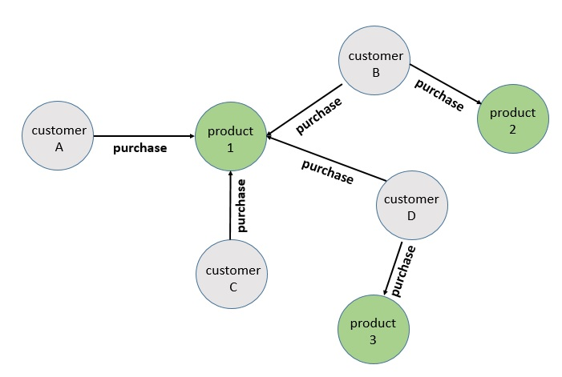

# This example shows how to load a collaborative filtering data set on Amazon Neptune

## Prerequisite

The cloudformation template will assume there is an already established Amazon Neptune Cluster. See the following links for how to create an Amazon Neptune Cluster for Gremlin:  

* https://docs.aws.amazon.com/neptune/latest/userguide/get-started-CreateInstance-Console.html
* https://docs.aws.amazon.com/neptune/latest/userguide/bulk-load.html
* https://docs.aws.amazon.com/neptune/latest/userguide/bulk-load-tutorial-format-gremlin.html

Also assumes you have a client on EC2 that can reach the Amazon Neptune Cluster

## Use Case

Build a recommendation engine based a collaborative filtering technique. This includes leveraging similiar relationships across vertices to infer what a new relationship might be. In this 
example we'll traverse customer purchases and based on similiar purchase history, we'll recommend new products for customers. 





## Step 1 (Load Data Sample data)

Edges ( ~id, ~from, ~to, ~label, PurchaseDate:Date) 

```
curl -X POST \
    -H 'Content-Type: application/json' \
    http://neptune-cluster:8182/loader -d '
    { 
      "source" : "s3://neptune-data-ml/edges-purchases-sm.csv", 
      "accessKey" : "", 
      "secretKey" : "",
      "format" : "csv", 
      "region" : "us-east-1", 
      "failOnError" : "FALSE"
    }'

```
Customers Vertices (~id, Login:String, FirstName:String, LastName:String, Gender:String, State:String, City:String, Address:String, ZIP:String
)

```
curl -X POST \
    -H 'Content-Type: application/json' \
    http://neptune-cluster:8182/loader -d '
    { 
      "source" : "s3://neptune-data-ml/vertex-customers-sm.csv", 
      "accessKey" : "", 
      "secretKey" : "",
      "format" : "csv", 
      "region" : "us-east-1", 
      "failOnError" : "FALSE"
    }'
```
Products Vertices (~id, ProductDescription:String, Price:String, SKU:String)

```
curl -X POST \
    -H 'Content-Type: application/json' \
    http://neptune-cluster:8182/loader -d '
    { 
      "source" : "s3://neptune-data-ml/vertex-products-sm.csv", 
      "accessKey" : "", 
      "secretKey" : "",
      "format" : "csv", 
      "region" : "us-east-1", 
      "failOnError" : "FALSE"
    }'

```

Alternatively, you could load all of the files by loading the entire directory

```
curl -X POST \
    -H 'Content-Type: application/json' \
    http://neptune-cluster:8182/loader -d '
    { 
      "source" : "s3://neptune-data-ml/", 
      "accessKey" : "", 
      "secretKey" : "",
      "format" : "csv", 
      "region" : "us-east-1", 
      "failOnError" : "FALSE"
    }'
```


## Sample Queries


```
g.V().has('AccountID','561588488401')

```

```
g.V().has("FirstName","Leroi")

```

```
g.V().has("Login","mlilie1@hc360.com")

```

**What was purchased ?**
```
g.V().has("Login","mlilie1@hc360.com").as('customer').out('purchase')

```

**Who else bought this ?**
```
g.V().has("Login","mlilie1@hc360.com").out('purchase').in('purchase').dedup().values('Login')

```

**Who else purchased this (exclude yourself)**
```
g.V().has("Login","mlilie1@hc360.com").as('TargetCustomer').out('purchase').in('purchase').where(neq('TargetCustomer')).dedup().values('Login')

```


**Other products these people have bought?**
```
g.V().has("Login","mlilie1@hc360.com").as('TargetCustomer').out('purchase').in('purchase').where(neq('TargetCustomer')).out('purchase').dedup().values('ProductDescription')

```

**products to recommend to BaseCustomer that BaseCustomer hasn't purchased.**
```
g.V().has("Login","mlilie1@hc360.com").as('TargetCustomer').out('purchase').aggregate('self').in('purchase').where(neq('TargetCustomer')).out('purchase').where(without('self')).dedup().values('ProductDescription')

```

## License

Copyright 2011-2018 Amazon.com, Inc. or its affiliates. All Rights Reserved.

Licensed under the Apache License, Version 2.0 (the "License"). You may not use this file except in compliance with the License. A copy of the License is located at

[http://aws.amazon.com/apache2.0/](http://aws.amazon.com/apache2.0/)

or in the "license" file accompanying this file. This file is distributed on an "AS IS" BASIS, WITHOUT WARRANTIES OR CONDITIONS OF ANY KIND, either express or implied. See the License for the specific language governing permissions and limitations under the License.


