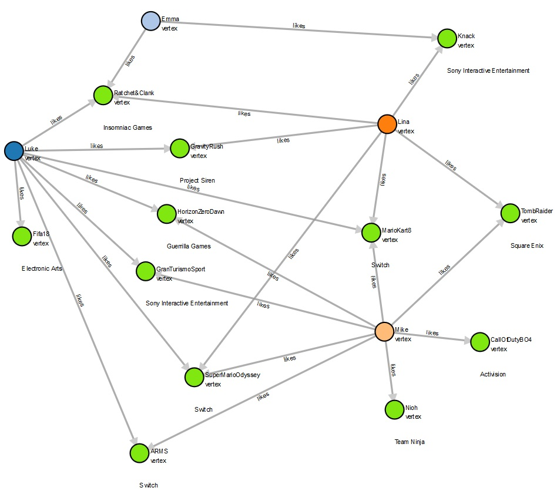

# Gremlin Tutorial

This example is a gremlin tutorial that shows how to explore the graph with sample queries. It also shows how to make recommendations using collaborative filtering. 

## Prerequisite

This tutorial assumes you already have your environment setup. To setup a new environment, create an Amazon Neptune Cluster. 

See the following links on how to create an Amazon Neptune Cluster for Gremlin and setup IAM authentication:  

* https://docs.aws.amazon.com/neptune/latest/userguide/get-started-CreateInstance-Console.html
* https://docs.aws.amazon.com/neptune/latest/userguide/bulk-load-tutorial-IAM.html
* https://docs.aws.amazon.com/neptune/latest/userguide/bulk-load.html
* https://docs.aws.amazon.com/neptune/latest/userguide/bulk-load-tutorial-format-gremlin.html

You will also need to load the data [files](data/) into an S3 bucket. 


## Use Case

In this tutorial, we'll traverse console game preferences among a small set of gamers and games. We'll explore commonality, preferences and make potential game recommendations. These queries are for the purposes of learning gremlin and Amazon Neptune. 





## Step 1 (Load Data Sample data)


**Game & Player Vertices** (~id,~label,GamerAlias:String,ReleaseDate:Date,GameGenre:String,ESRBRating:String,Developer:String,Platform:String,GameTitle:String)

```
curl -X POST \
    -H 'Content-Type: application/json' \
    http://your-neptune-endpoint:8182/loader -d '
    { 
      "source" : "s3://your-s3-bucket/vertex.txt", 
      "iamRoleArn" : "arn:aws:iam::account-id:role/role-name",
      "format" : "csv", 
      "region" : "us-east-1", 
      "failOnError" : "FALSE"
    }'
```

**Edges** (~id, ~from, ~to, ~label, weight:Double) 
```
curl -X POST \
    -H 'Content-Type: application/json' \
    http://your-neptune-endpoint:8182/loader -d '
    { 
      "source" : "s3://your-s3-bucket/recommendation/edges.txt", 
      "iamRoleArn" : "arn:aws:iam::account-id:role/role-name",
      "format" : "csv", 
      "region" : "us-east-1", 
      "failOnError" : "FALSE"
    }'
```

**Tip.** Alternatively, you could load all of the files by loading the entire directory
```
curl -X POST \
    -H 'Content-Type: application/json' \
    http://your-neptune-endpoint:8182/loader -d '
    { 
      "source" : "s3://your-s3-bucket/", 
      "iamRoleArn" : "arn:aws:iam::account-id:role/role-name",
      "format" : "csv", 
      "region" : "us-east-1", 
      "failOnError" : "FALSE"
    }'
```

**Tip.**
Upon executing each curl command, Neptune will return the loadId associated with each request. You can check the status of your load with the following command:
```
curl http://your-neptune-endpoint:8182/loader?loadId=[loadId value]
```

For more information about loading data into Amazon Neptune visit: https://docs.aws.amazon.com/neptune/latest/userguide/bulk-load.html

## Sample Queries


**Query for a particular vertex (gamer)**

```
gremlin> g.V().hasId('Luke').valueMap()
==>{GamerAlias=[skywalker123]}

gremlin> g.V().has("GamerAlias","skywalker123").valueMap()
==>{GamerAlias=[skywalker123]}

gremlin> g.V().has('GamerAlias','skywalker123')
==>v[Luke]
```

**Sample some of the edges (limit 5)**
```
gremlin> g.E().limit(5)
==>e[e25][Luke-likes->SuperMarioOdyssey]
==>e[e26][Mike-likes->SuperMarioOdyssey]
==>e[e8][Mike-likes->CallOfDutyBO4]
==>e[e1][Luke-likes->HorizonZeroDawn]
==>e[e9][Mike-likes->GranTurismoSport]
```

**Sample some of the vertices (limit 4)**
```
gremlin> g.V().limit(4)
==>v[SuperMarioOdyssey]
==>v[Luke]
==>v[Emma]
==>v[MarioKart8]
```

**Count the in-degree centrality of incoming edges to each vertex**
```
gremlin> g.V().group().by().by(inE().count())
==>{v[HorizonZeroDawn]=2, v[Luke]=0, v[ARMS]=2, v[Ratchet&Clank]=3, v[SuperMarioOdyssey]=3, v[GravityRush]=2, v[CallOfDutyBO4]=1, v[MarioKart8]=3, v[Fifa18]=1, v[Nioh]=1, v[Mike]=0, v[Knack]=2, v[Lina]=0, v[TombRaider]=2, v[GranTurismoSport]=2, v[Emma]=0}
```

**Count the out-degree centrality of outgoing edges from each vertex**
```
gremlin> g.V().group().by().by(outE().count())
==>{v[HorizonZeroDawn]=0, v[Luke]=8, v[ARMS]=0, v[Ratchet&Clank]=0, v[SuperMarioOdyssey]=0, v[GravityRush]=0, v[CallOfDutyBO4]=0, v[MarioKart8]=0, v[Fifa18]=0, v[Nioh]=0, v[Mike]=8, v[Knack]=0, v[Lina]=6, v[TombRaider]=0, v[GranTurismoSport]=0, v[Emma]=2}

```
**Count the out-degree centrality of outgoing edges from each vertex by order of degree**
```
gremlin> g.V().project("v","degree").by().by(bothE().count()).order().by(select("degree"), decr)
==>{v=v[Luke], degree=8}
==>{v=v[Mike], degree=8}
==>{v=v[Lina], degree=6}
==>{v=v[SuperMarioOdyssey], degree=3}
==>{v=v[MarioKart8], degree=3}
==>{v=v[Ratchet&Clank], degree=3}
==>{v=v[Emma], degree=2}
==>{v=v[HorizonZeroDawn], degree=2}
==>{v=v[GranTurismoSport], degree=2}
==>{v=v[ARMS], degree=2}
==>{v=v[GravityRush], degree=2}
==>{v=v[TombRaider], degree=2}
==>{v=v[Knack], degree=2}
==>{v=v[Fifa18], degree=1}
==>{v=v[Nioh], degree=1}
==>{v=v[CallOfDutyBO4], degree=1}
```

**Return only the vertices that are games**
```
gremlin> g.V().hasLabel('game')
==>v[Mario+Rabbids]
==>v[ARMS]
==>v[HorizonZeroDawn]
==>v[GranTurismoSport]
==>v[Ratchet&Clank]
==>v[Fifa18]
==>v[GravityRush]
==>v[Nioh]
==>v[TombRaider]
==>v[CallOfDutyBO4]
==>v[Knack]
==>v[SuperMarioOdyssey]
==>v[MarioKart8]
```

**Return only the vertices that are gamers**
```
gremlin> g.V().hasLabel('person')
==>v[Luke]
==>v[Emma]
==>v[Lina]
==>v[Mike]
```

**Return counts of games grouped by game genre**
```
gremlin> g.V().hasLabel('game').groupCount().by("GameGenre")
==>{Shooter=2, Action=3, Adventure=5, Racing=2, Sports=1}
```
**Return counts of games grouped by developer**
```
gremlin> g.V().hasLabel('game').groupCount().by("Developer")
==>{Activision=1, Nintendo=3, Square Enix=1, Guerrilla Games=1, Sony Interactive Entertainment=2, Insomniac Games=1, Electronic Arts=1, Project Siren=1, Ubisoft=1, Team Ninja=1}
```

**Return counts of games grouped by Platform**
```
gremlin> g.V().hasLabel('game').groupCount().by("Platform")
==>{PS4=9, Switch=4}
```

**What is the average weighted rating of MarioKart8?**
```
gremlin> g.V().hasLabel('game').has('GameTitle','MarioKart8').inE('likes').values('weight').mean()
==>0.6333333333333334
```

**What games does skywalker123 like?**
```
gremlin> g.V().has('GamerAlias','skywalker123').as('gamer').out('likes')
==>v[ARMS]
==>v[HorizonZeroDawn]
==>v[GranTurismoSport]
==>v[Ratchet&Clank]
==>v[Fifa18]
==>v[GravityRush]
==>v[SuperMarioOdyssey]
==>v[MarioKart8]
```

**What games does skywalker123 like using weight (greater than)?**
```
gremlin> g.V().has('GamerAlias','skywalker123').outE("likes").has('weight', P.gt(0.7f))
==>e[e17][Luke-likes->Mario+Rabbids]
==>e[e3][Luke-likes->Ratchet&Clank]
```

**What games does skywalker123 like using weight (less than)?**
```
gremlin> g.V().has('GamerAlias','skywalker123').outE("likes").has('weight', P.lt(0.5f))
==>e[e1][Luke-likes->HorizonZeroDawn]
==>e[e2][Luke-likes->GranTurismoSport]
==>e[e4][Luke-likes->Fifa18]
==>e[e5][Luke-likes->GravityRush]
==>e[e21][Luke-likes->MarioKart8]
```

**Who else likes the same games?**
```
gremlin> g.V().has('GamerAlias','skywalker123').out('likes').in('likes').dedup().values('GamerAlias')
==>forchinet
==>skywalker123
==>bringit32
==>smiles007
```

**Who else likes these games (exclude yourself)?**
```
gremlin> g.V().has('GamerAlias','skywalker123').as('TargetGamer').out('likes').in('likes').where(neq('TargetGamer')).dedup().values('GamerAlias')
==>forchinet
==>bringit32
==>smiles007
```

**What are other game titles do other gamers like, who have commonality?**
```
gremlin> g.V().has('GamerAlias','skywalker123').as('TargetGamer').out('likes').in('likes').where(neq('TargetGamer')).out('likes').dedup().values('GameTitle')
==>ARMs
==>HorizonZeroDawn
==>GranTurismoSport
==>Nioh
==>TombRaider
==>CallOfDutyBO4
==>SuperMarioOdyssey
==>MarioKart8
==>Ratchet&Clank
==>GravityRush
==>Knack
```

**Which games might make sense to recommend to a specific gamer that they don't already like?**
```
gremlin> g.V().has('GamerAlias','skywalker123').as('TargetGamer').out('likes').aggregate('self').in('likes').where(neq('TargetGamer')).out('likes').where(without('self')).dedup().values('GameTitle')
==>Nioh
==>TombRaider
==>CallOfDutyBO4
==>Knack
```

For more recommendation example queries or other gremlin recipes you can also visit: http://tinkerpop.apache.org/docs/current/recipes/#recommendation


**Drop data**
```
gremlin> g.V().drop().iterate()

```
## License Summary

This sample code is made available under a modified MIT license. See the LICENSE file.

