# Six Degrees of Kevin Bacon - An Example of an ETL Process for Transforming and Loading Data Into Amazon Neptune

### Description

Amazon Neptune is a fast, reliable, fully-managed graph database service that runs within AWS.  This example shows how you can take data that was formerly in some form of relational data model, manipulate that data into a graph model, and then use other services in AWS to perform the data transformation into the data format supported for loading into Amazon Neptune.

The following example uses the open IMDB dataset.  This is a small subset of the full IMDB.com application.  With this dataset, we want to develop an application that allows for us to find whether or not an actor or actress is no more than six degrees separated from the actor Kevin Bacon.

### Step 1: Download the IMDB Dataset

The IMDB data set can be found here: https://www.imdb.com/interfaces/ 

We will not be using the entire dataset, only the data pertaining to actors/actresses and movie/TV productions.  These two attributions and the relationships between them can be found in the following files:
- **name.basics.tsv.gz** - contains name and demographic information on each actor/actress.
- **title.basics.tsv.gz** - contains the title and other information for all movie/TV productions.
- **title.principals.tsv.gz** - contains the relationships between actor/actress and their performances/productions.

Download each of these files and store them in an S3 bucket under a separate prefix for each file.  Example: 
- **s3://workingbucket/names/name.basics.tsv.gz**
- **s3://workingbucket/titles/title.basics.tsv.gz**
- **s3://workingbucket/principals/title.principals.tsv.gz**

*NOTE: We have to separate each file into a separate prefix due to a constraint of Amazon Athena (used later) that cannot access AWS Glue Data Catalog tables that refenece individual files. This will only work with S3 prefixes.*

### Step 2: Use AWS Glue to Crawl and Discover Data Schema

AWS Glue is a service that performs two primary task - Cataloging data and providing a centralized repository of data locations and schema via a managed Hive Metastore called the Data Catalog. Performing data transformation operations through the use of underlying Apache Spark resources and PySpark scripts (some of which are AWS provided, but customers can provide their own).

We'll use AWS Glue to crawl the IMDB dataset, discover the schema for the files that we've downloaded, and use the discovered schema (stored in the AWS Data Catalog) to query this data in latter steps.

Go to the AWS Glue [console](https://console.aws.amazon.com/glue/home).  On the left hand side of the screen, click on Crawlers.  Click the button to **"Add crawler"**.  Here, we're going to create a new crawler that will scan the IMDB files to discover their structure.  

After clicking the Add Crawler button, a Wizard will launch to create a new crawler.  Give the crawler in name.  In this example, I'm using "myimdbcrawler".  Click Next.

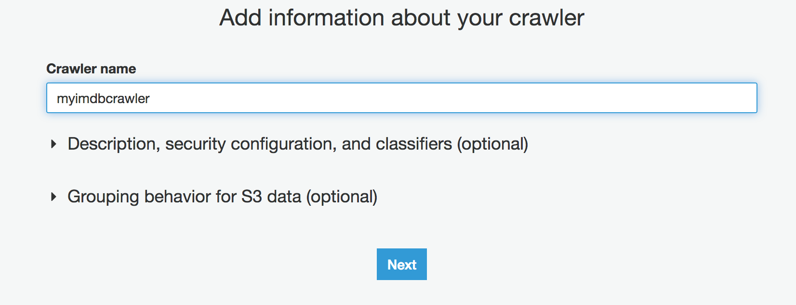

Next, you will provide the location of the IMDB data to be crawled.  Provide the S3 bucket and prefixes where the IMDB files were uploaded (Ex: list of S3 paths from previous step). Add the first prefix and click Next.

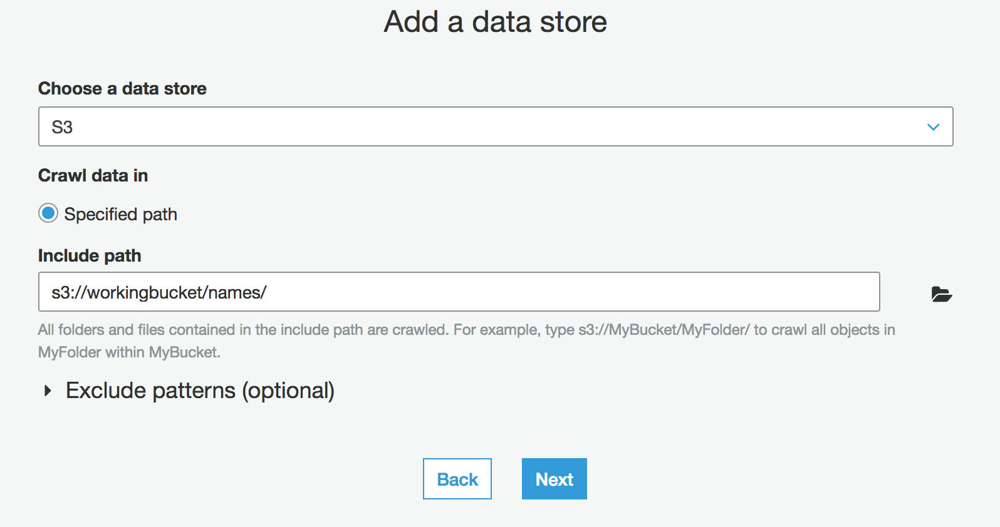

When asked to 'Add another data store', select Yes and click Next.  Add the second prefix and continue this process until all three prefixes have been added.

You'll need to provide AWS Glue with permissions to access the S3 bucket where the data is located. You can provide an IAM role that you create on your own, or you can allow this wizard to create an IAM role for you.  I have chosen the latter. Click Next.

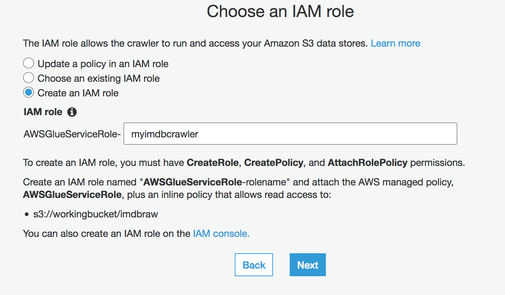

The next step asks you to provide a schedule to run the crawler.  Since I am only performing this operation once for this example, I'll leave the schedule Frequency at the default of 'Run on demand'. Click Next.

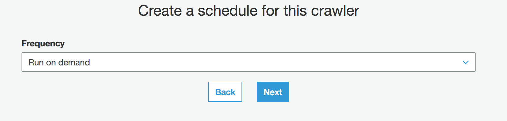

Once the crawler has read the IMDB files, it will need to store the data schema in the form of a database.  Note, this does not copy any data from the files into a new location.  This operation only defines the data schema so that we can query the files in later steps.  Click the button to 'Add database' and provide a name for a new database.  In this example, I'm using 'imdbdata'.  Click Next.

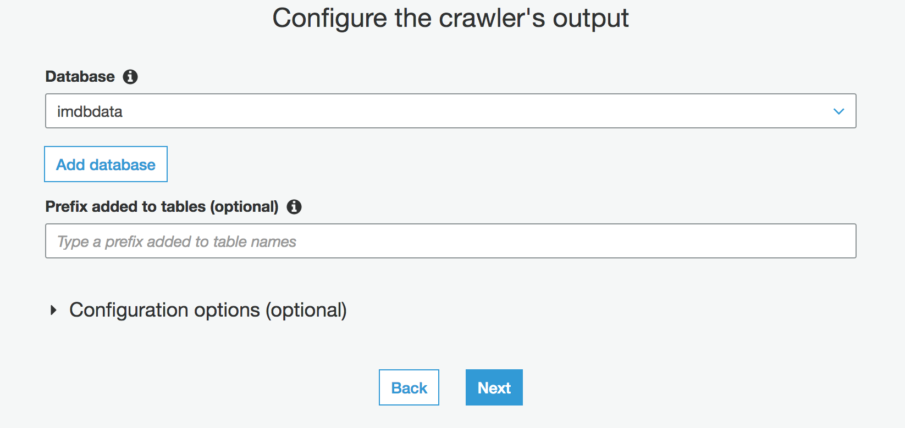

Lastly, a review screen will appear with all of the options provided.  Click the Finish button to complete the wizard.

This will return you to the Crawler screen in the Glue console.  A notification at the top of the screen should appear with the question 'Crawler myimdbcrawler was created to run on demand. Run it now?'.  Click on the 'Run it now' link to start the crawler.  This should take a few minutes to run.

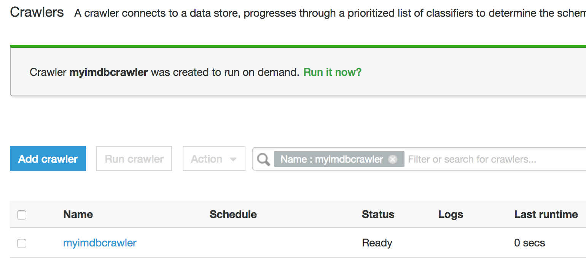

### Step 3: Review and Modify the Glue Database Schema

After the crawler has completed it's run, you should be able to browse the data catalog and see three new tables created under the database that we previously created (imdbdata in this example).  On the left side of the Glue console under Data Catalog and under Databases, click Tables.  The three tables that were created should be **names**, **titles**, and **principals**.

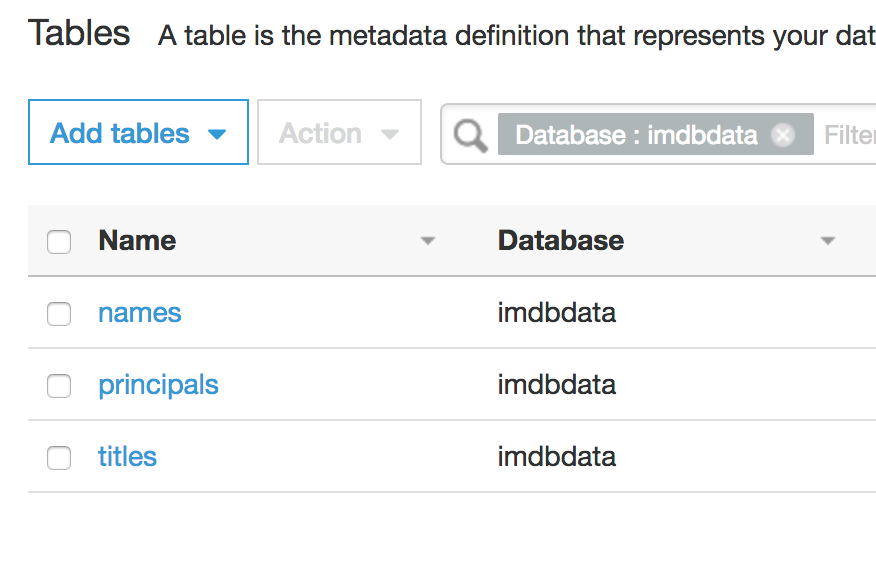

In some cases, the Glue crawler will not pick up the column headers from the IMDB data files.  You'll want to go into each table and edit these headers to make it easier when querying this data in later steps.

Click on the **names** table.  At the bottom of the screen you will see a table that details the schema for this Glue Data Catalog table.  

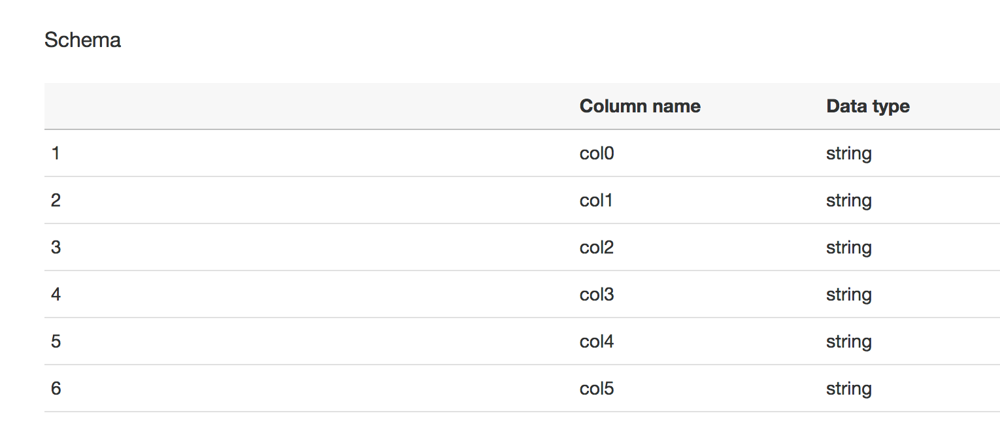

Each of the column names are generic (ex: col0, col1, etc.).  To edit these, click on the Edit schema button in the top right of the screen.  From the Edit Schema screen, we can edit the columns to reflect the same column headings provided in the IMDB dataset [descriptions](http://www.imdb.com/interfaces).

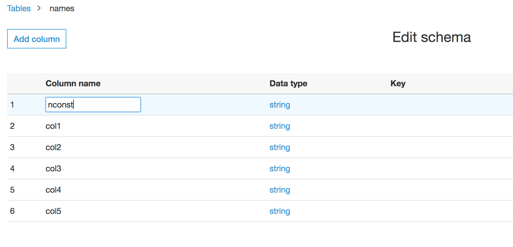

Once completed, the schema should look like the image below.  We've also changed the data type for both the birthYear and deathYear fields as those are better represented as a smallint versus a string.

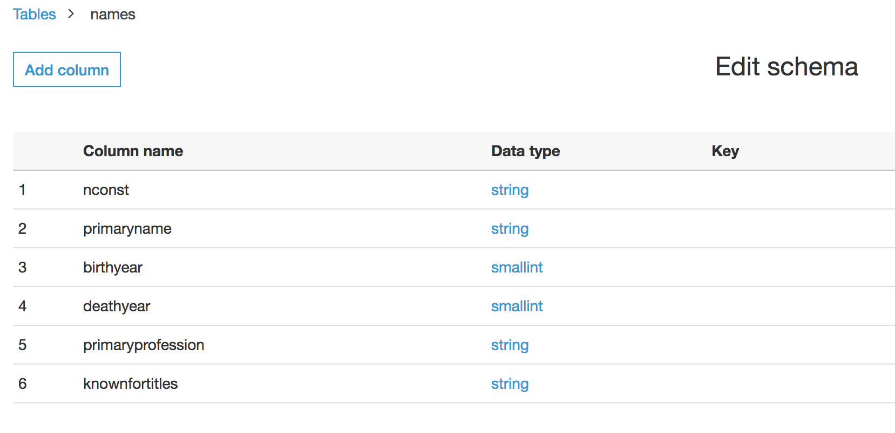

Check the two other tables - titles and principals.  If the headers did not come through for those files, fix the headers in those tables as well. (NOTE: In my experience, the titles and princpals tables had the proper headers after being crawled.)

### Step 4: Using Amazon Athena to Query the IMDB Dataset

After the IMDB files have been crawled and their schema has been cataloged within AWS Glue, we can now use a service called Amazon Athena to directly query these files using simple SQL syntax.  Amazon Athena is a serverless, interactive query service that makes it easy to analyze data stored in Amazon S3 using standard SQL.

Go to the Amazon Athena [console](http://console.aws.amazon.com/athena/home). You will be greeted with a Query Editor screen that looks similar to this.

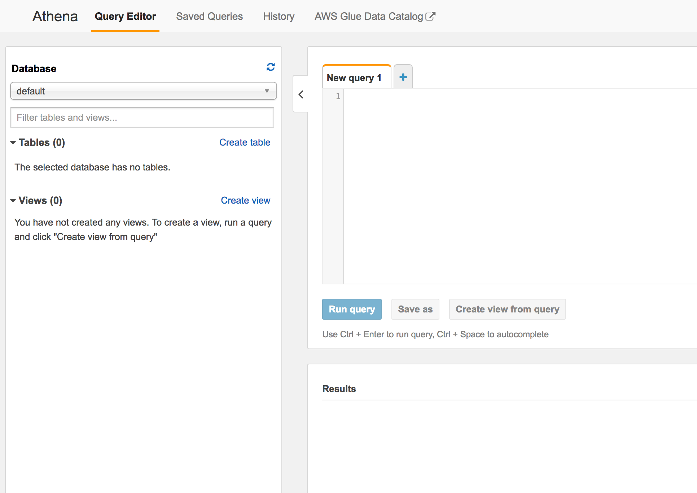

In the Databases drop-down menu, you should find the **imdbdata** database that we previously created from AWS Glue.  Select this database.  After selecting the database, you should also now see the three tables associated with this database under the Tables heading.

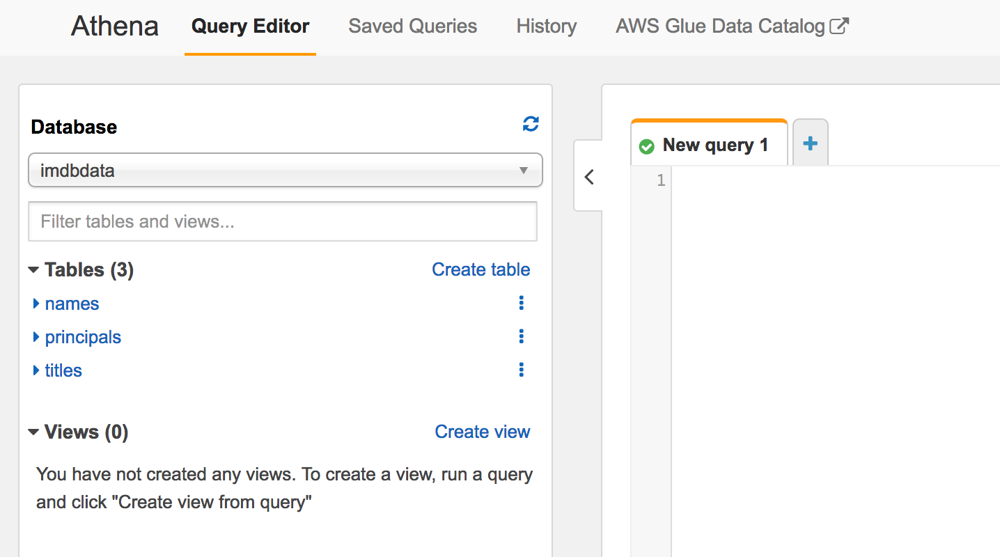

To test, click on the 3 dots to the right of the names table and select Preview Table.  This will query the first 10 rows of the names table.

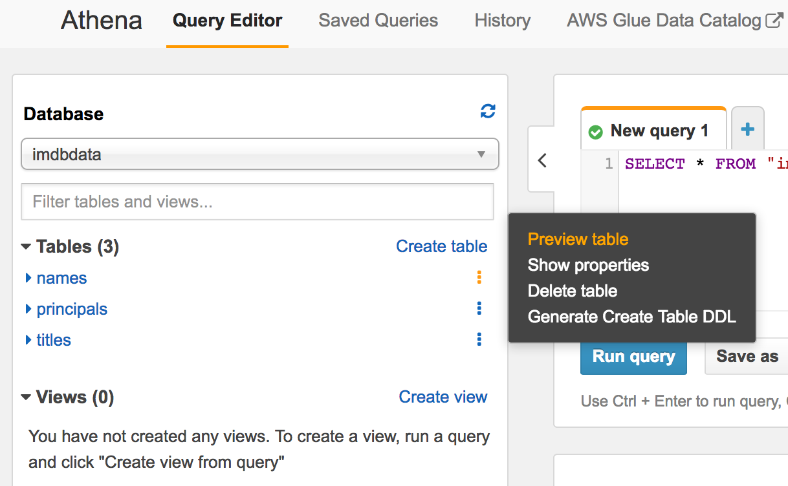

You should see the following results in the Results pane of the console:

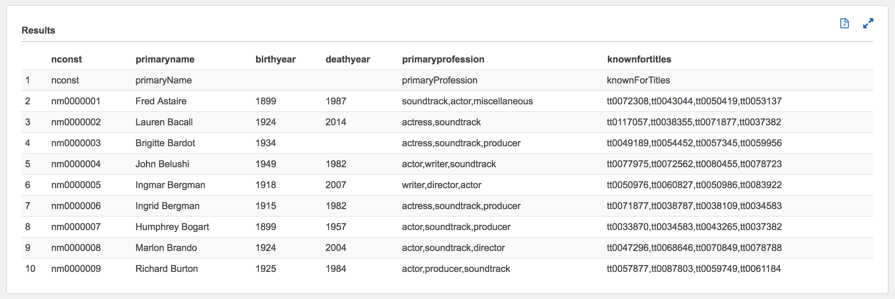

*NOTE: You may notice that the headers for the 'names' table were not handled correctly by AWS Glue and found their way into the dataset as row number 1.  We could either manually fix this in the original IMDB dataset and rerun the crawler, or (and in this example) we can handle fixing this in our SQL queries.*

### Step 5: Creating a Graph Data Model for the IMDB Dataset

In the next few steps we will look to use Amazon Athena to query the IMDB data into a format that Amazon Neptune supports for [bulk loading](https://docs.aws.amazon.com/neptune/latest/userguide/bulk-load.html) data into a graph database instance.  Before we get to this, we need to determine what our graph data model should look like.

The IMDB dataset that we're using has three tables: names, titles, and principals.  Both the names and titles tables have unique IDs for each row.  The principals table uses these same IDs (in a foreign key pattern) to relate actors/actresses to the movie/TV productions in which they performed.  

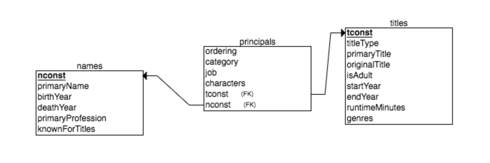

If you think of this in terms of a graph model, we can view actors/actresses as verticies in our graph.  We can also view the movie/TV productions as verticies as well.  Lastly, we can use the principals table and the relationships it has defined to determine the edges in our graph.

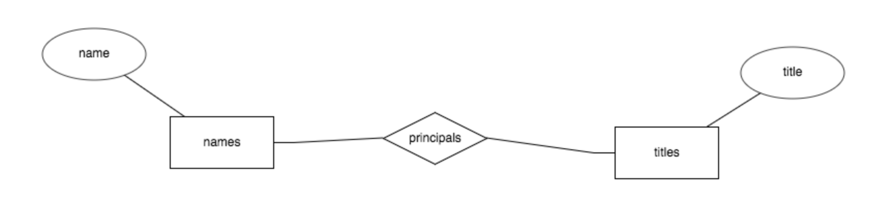

In this mindset, we'll need to create SQL queries against the IMDB tables to extract actors/actresses as nodes, movie/TV titles as nodes, and create edges from the principals table.

### Step 6: Creating Bulk Load CSV Files for Input Into Amazon Neptune

Amazon Neptune has the capability to bulk load data into a graph database instance using a specific CSV file format.  CSV files can be created for both nodes and edges.  The CSV file format for nodes will have the following headings:
 - **~id** - This will be the unique ID for each node in the graph. For this dataset, we'll use the same nconst and tconst fields from both the names and titles tables respectively to represent the node IDs.
- **~label** - A label distinguishes the object type for a give node.  Think of this similarly to a table name from the relational model. In this case, we'll have two labels - **actor** and **movie**.
- **properties** - After the ~id and ~label fields, the next fields can be any additional attributes that you want to relate to this given node.  In this case, we'll have a **name** that will be tied to an **actor** node.  We'll also have a **title** property tied to a **movie** node.

The CSV format for an Edge file is similar, except now we're defining the connections between nodes in the graph.  Edges can also have labels and properties!! The Edge CSV format is as such:
-  **~id** - The ID for a given edge. This must be unique per edge.  In our case, we'll combine the nconst and tconst for each relationship and make that an ID for each edge.
- **~from** - This represents the ID of the node from which we're drawing this relationship.  Edges have directionality, so it is important that we build the edge in the correct direction.  Since we're looking for relationships between actors/actresses based on the productions they were in, we'll want to build our edges in the direction from an actor to a movie.
- **~to** - The unique ID of the node to which the edge is being defined towards.
- **~label** - In a graph model, an edge label is typical a representation of the relationship.  In this case, the edges represent appearances by an actor/actress in a given movie production.  For this case, we'll call the edge label "appearedin".
- **properties** - You can also add additional properties to an edge.  I'm not doing adding these in this example, but you could add the year the film was created or any other properties that are also in the 'principals' table from the originating dataset.

To build these files, we'll use some SQL queries in Athena against the original tables.  For each of the queries below, create a new New Query Tab in the Athena console.  After entering the SQL syntax for each query, save the query with easy to remember name.  For my example, I use **"imdb-nodes-actors"**, **"imdb-nodes-movies"**, and **"imdb-edges-appearedin"**.

**IMPORTANT: If you do not save the queries, it will be difficult to find the output CSV files after they are ran.  Please do this as you're running the below SQL queries.**

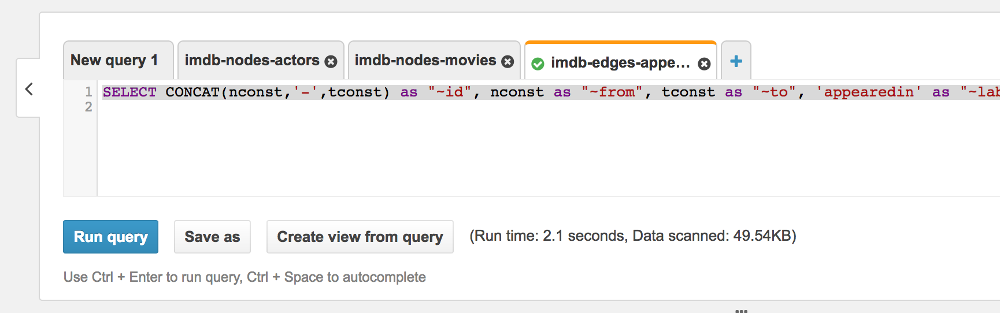

##### Actor/Actress CSV File

For the CSV file to define the actors/actress nodes, we'll run the following SQL query:

`SELECT nconst as "~id", 'actor' as "~label", primaryName as "name" FROM "imdbdata"."names" where primaryName!='primaryName';`

This will return an output like the following:

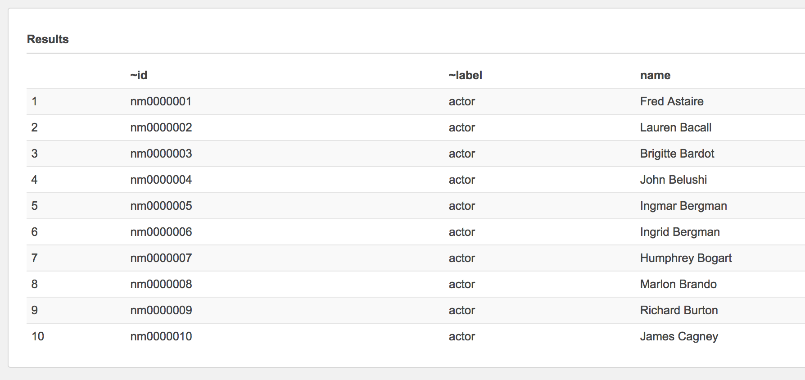

*Note the use of the `where primaryName!='primaryName` in the query.  This takes care of the situation where AWS Glue didn't handle the table headers correctly.*

##### Movie Titles CSV File

For the CSV file to define the movie titles, we'll run the following SQL query:

`SELECT tconst as "~id", 'movie' as "~label", primarytitle as "title"FROM "imdbdata"."titles";`

The output should look similar to this:

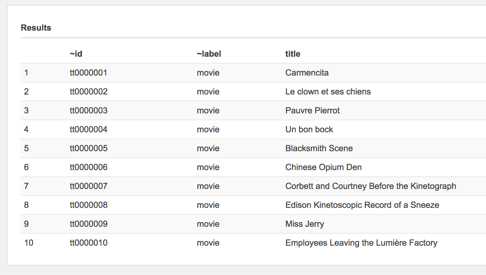

##### AppearedIn Edge CSV File

To create the edges in the graph, we'll use the following SQL query against the principals table:

`SELECT CONCAT(nconst,'-',tconst) as "~id", nconst as "~from", tconst as "~to", 'appearedin' as "~label" FROM "imdbdata"."principals";`

The output should appear as:

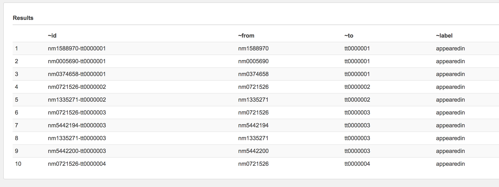

### Step 7: Move Athena Output Files to S3 Bucket for Bulk Load

After running each of the queries in the previous step, Athena will store the results of these queries in an S3 bucket that starts with "aws-athena-query-results".  The suffix of the S3 bucket name will be your AWS account number and the region from which you ran the Athena queries.

Within this S3 bucket, you should see prefixes that have the same name as the queries that you created above.

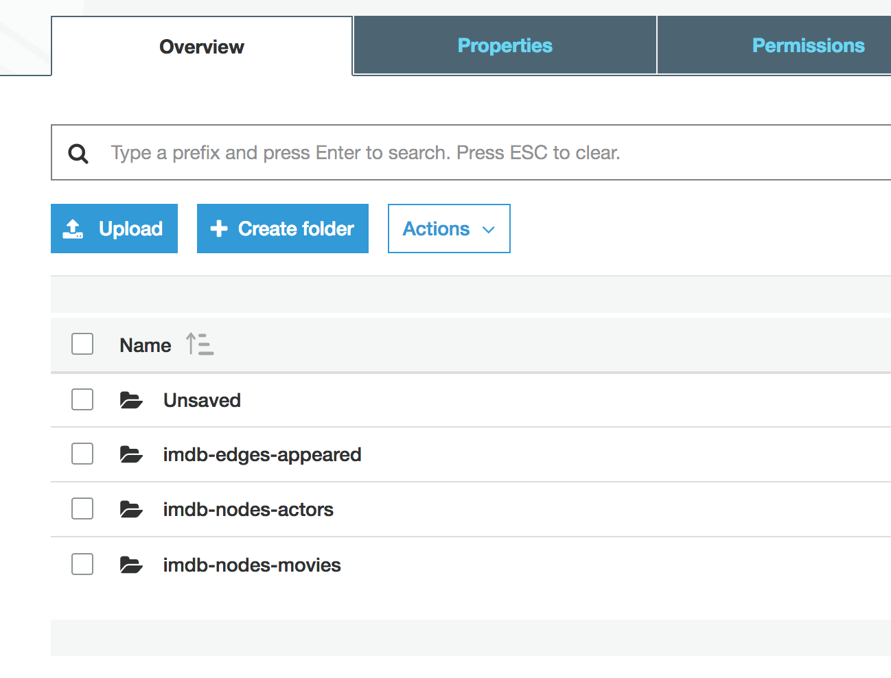

Open up each of these prefixes.  You'll want to get the latest CSV output file within each prefix and copy these to another location.  I created another prefix in my "workingbucket" where I originally stored the downloaded data from IMDB.  For this example, I'll use **s3://workingbucket/imdbneptune** as the prefix where I'll store these CSV files.

*NOTE: Do not bother downloading these files locally and then re-uploading them.  Just use the AWS CLI and the `aws s3 cp` command to copy the files from their location within the Athena bucket over to your working bucket and prefix.*

### Step 8: Prepare Neptune Instance for Bulk Load

##### (If necessary) Create a New Neptune Environment
Before this data can be loaded into a Neptune instance, we'll need to complete a few items:
- Create a new Neptune cluster/instance (if you have not already done so).
- Create a management EC2 instance to connect to Neptune for both bulk loading and for querying the graph after the load process has completed.

*NOTE: Both of the steps above can be completed using a Cloudformation Quick Start template that is available here: https://docs.aws.amazon.com/neptune/latest/userguide/quickstart.html#quickstart-cfn*

##### Provide Permissions for Neptune to Access CSV Files for Bulk Load

Once the Neptune cluster and management EC2 instance are up and running, we'll need to complete the following steps:
- Create an IAM role that has access to the CSV files within S3 that will be loaded into Neptune.  This should be an RDS service-backed role that has access to the S3 bucket/prefix where the CSV files are located.
- Add the IAM role to the Neptune cluster.  This will give the cluster access to read the CSV files for loading.
- Add an S3 VPC Endpoint to the VPC hosting the Neptune cluster.  Neptune does not have native access to S3.  A VPC Endpoint is needed to allow Neptune to access S3 directly.

*NOTE: Each of the above steps are more detailed in the following: https://docs.aws.amazon.com/neptune/latest/userguide/bulk-load-tutorial-IAM.html*

### Step 9: Load the Data Into Neptune

Once Neptune has the proper access, you can start the loading process.  The bulk loader gets instantiated via a REST API call to the Neptune cluster endpoint.

##### Find the Neptune Cluster Endpoint

To find the endpoint for your Neptune cluster, go to the Neptune [console](https://console.aws.amazon.com/neptune/home).

If not already shown, expand the menu on the left hand side of the screen using the hamburger button at the top left corner.

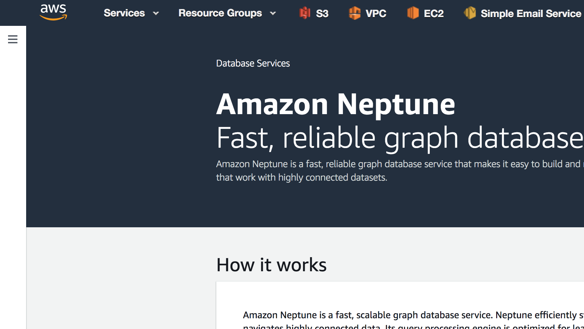


Click on Clusters.  Then select the cluster that you'll be using.

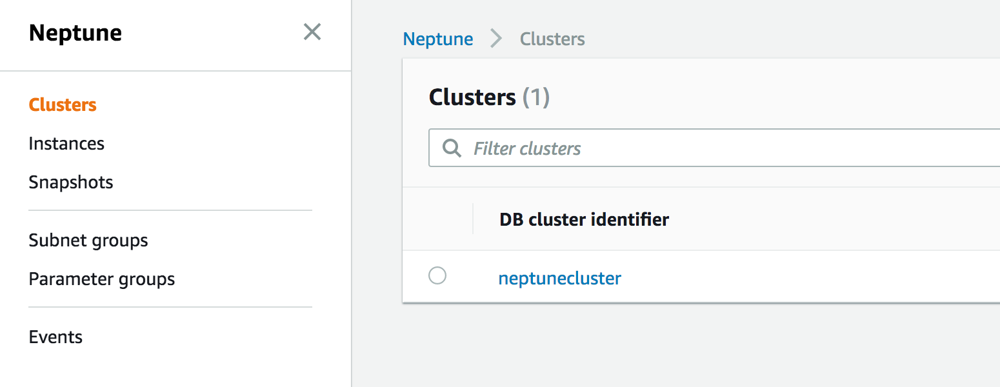

Under the Details pane of the Cluster Info screen, you'll find the Cluster Endpoing for your cluster.  You'll need this to start the bulk load process.

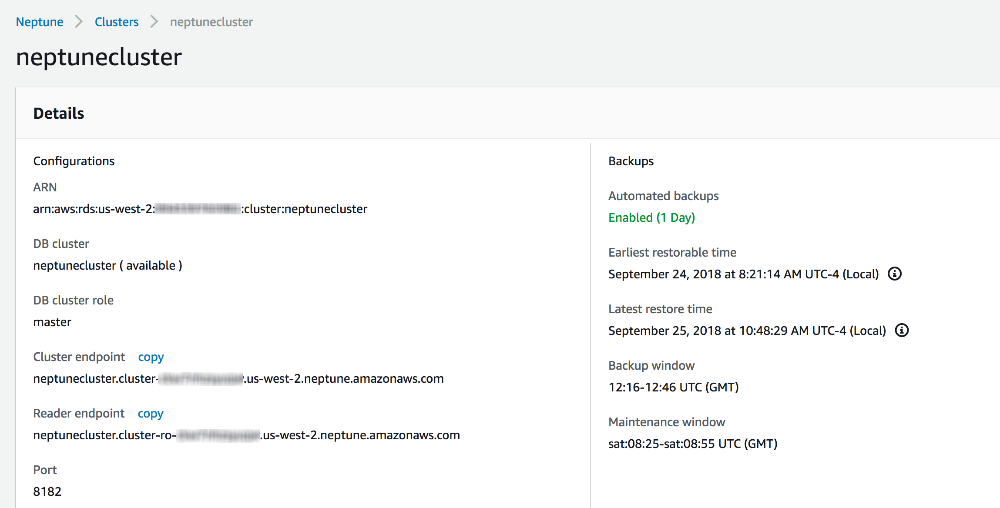

##### Submit Bulk Load API Call

To kick off the bulk load process, we need to make a REST API call to the Neptune loader.  We can do this using a curl command on our EC2 managment instance.

SSH to the EC2 management instance that has connectivity to your Neptune cluster.  Using the following format, insert your Neptune Cluster Endpoint, the region where your instance is located, your S3 bucket/prefix where your CSV files are located, and the ARN for the IAM role that you gave your Neptune Cluster to access your data in S3:
```
curl -X POST \
    -H 'Content-Type: application/json' \
    http://your-neptune-endpoint:8182/loader -d '
    { 
      "source" : "s3://bucket-name/object-key-name", 
      "format" : "csv",  
      "iamRoleArn" : "arn:aws:iam::account-id:role/role-name", 
      "region" : "region", 
      "failOnError" : "FALSE"
    }'
```

An example may look like this:
```
curl -X POST \
    -H 'Content-Type: application/json' \
    http://neptunecluster.cluster-abcdefghi123.us-west-2.neptune.amazonaws.com:8182/loader -d '
    { 
      "source" : "s3://workingbucket/imdbneptune", 
      "format" : "csv",  
      "iamRoleArn" : "arn:aws:iam::1234567890:role/NeptuneS3ReadRole", 
      "region" : "us-west-2", 
      "failOnError" : "FALSE"
    }'
```

After making this call, you should get a response that looks like:
```
{
    "status" : "200 OK",
    "payload" : {
        "loadId" : "ef478d76-d9da-4d94-8ff1-08d9d4863aa5"
    }
}
```
Where the loadId is the job ID for the bulk loader.

### Step 10: Monitor the Loading Process

Once the load process kicks off, you can monitor the load status using the following curl command from your EC2 managment instance, but replacing the loadId at the end of the URL with the loadID that you received after submitting the load API call:
```
curl -G 'http://your-neptune-endpoint:8182/loader/ef478d76-d9da-4d94-8ff1-08d9d4863aa5'
```

This will return a response similar to:
```
{
    "status" : "200 OK",
    "payload" : {
        "feedCount" : [
            {
                "LOAD_NOT_STARTED" : 1
            },
            {
                "LOAD_IN_PROGRESS" : 1
            },
            {
                "LOAD_COMPLETED" : 1
            }
        ],
        "overallStatus" : {
            "fullUri" : "s3://workingbucket/imdbneptune",
            "runNumber" : 1,
            "retryNumber" : 4,
            "status" : "LOAD_IN_PROGRESS",
            "totalTimeSpent" : 52,
            "totalRecords" : 9720000,
            "totalDuplicates" : 9720000,
            "parsingErrors" : 0,
            "datatypeMismatchErrors" : 0,
            "insertErrors" : 0
        }
    }
```

### Step 11: Sample Traversals (Post Load)

Once this has completed, you can login to the Neptune instance using the Gremlin client on the EC2 management instance and run some sample traversals.  Some fun ones to consider are:

###### Return a count of nodes by label
```
gremlin> g.V().groupCount()
```
###### Find Kevin Bacon (all of them ;) )
```
gremlin> g.V().has('name','Kevin Bacon')
```
###### Find all movies that Kevin Bacon appeared in
```
gremlin> g.V().has('name','Kevin Bacon').out().values()
```
###### Find all relationships from a given actor/actress to Kevin Bacon (the six degrees)
```
gremlin> g.V().has('name','Jack Nicholson').repeat(out().in().simplePath())
    .until(has('name','Kevin Bacon')).path().by('name').by('title').limit(10)
```
