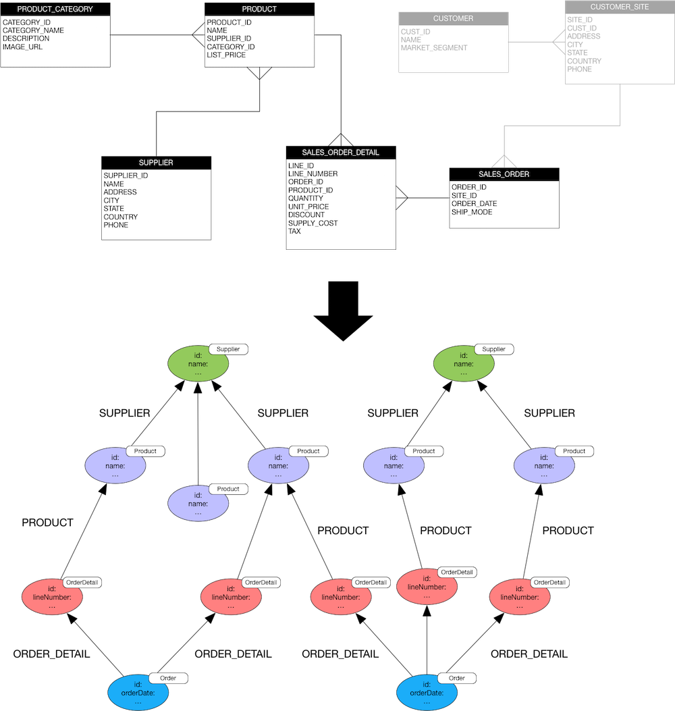
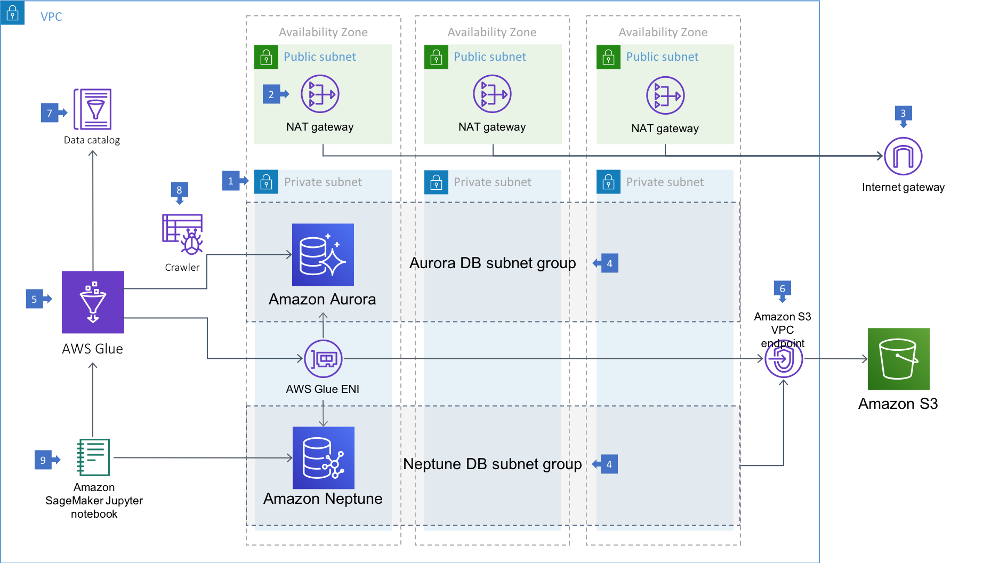

# Migrating from MySQL to Amazon Neptune using AWS Glue

This demo shows how to migrate relational data from MySQL to Amazon Neptune using AWS Glue.

The demo uses several different migration techniques:

- Extract data from MySQL to Amazon S3 as CSV files. Bulk load from the CSV files into Neptune.
- Extract data from MySQL and write it directly to Neptune.
- Incrementally load data from MySQL to Neptune.

The two data models are shown below. The MySQL database contains details of products, suppliers, orders and customers. The demo shows us migrating products, suppliers and orders data, but not customer data – though there's no reason it couldn't be expanded to also migrate customer data. We leave that as an exercise for the reader.

The scripts for the AWS Glue jobs can be found [here](https://github.com/aws-samples/amazon-neptune-samples/tree/master/gremlin/glue-neptune/glue-jobs/). The scripts use the [glue_neptune](https://github.com/awslabs/amazon-neptune-tools/tree/master/glue-neptune) Python library.

## Setup

Install the components using CloudFormation:

| Region | Stack |
| ---- | ---- |
|US East (N. Virginia) |   |
|US East (Ohio) |   |
|US West (Oregon) |   |
|EU (Ireland) |   |
|EU (London) |   |
|EU (Frankfurt) |   |

Once the stack creation has completed, open the Outputs tab of the *mysql-2-neptune* root stack, and click on the *SageMakerNotebook* URI. This will open an Amazon SageMaker Jupyter notebook. Navigate to the */Neptune/glue-neptune/* directory. From there you can complete each of the migration steps.

### Step 1 – Prepare the Environment

In this notebook we prepare the environment – loading data into MySQL, and crawling the database in order to populate the AWS Glue data catalog.

### Step 2 – Export from MySQL to S3 and then Bulk Load from S3

In this notebook we trigger a one-off export of data from MySQL to Neptune via S3. We use an AWS Glue job to export product, product category and supplier data to CSV files, which the job copies to S3. We then use the Neptune bulk load API to load the data from S3 into Neptune.
  
### Step 2 (Alternative) – Export Direct from MySQL to Neptune
  
In this notebook we look at an alternative method for exporting data from MySQL to Neptune. Instead of exporting to CSV files and using the Neptune bulk loader to load the data into Neptune, we use an AWS Glue job that extracts data from MySQL and inserts it directly into Neptune.
  
### Step 3 – Incremental Import from MySQL to Neptune

In this notebook we incrementally export frequently changing orders and order details data from MySQL into Neptune.

## Walkthrough of the Architecture

  1. The Amazon Neptune and Amazon Aurora MySQL database clusters are run in three private subnets in three Availability Zones, with each subnet in a different AZ. The architecture employs private subnets as per the [AWS Glue recommendations for data stores](https://docs.aws.amazon.com/glue/latest/dg/populate-add-connection.html). ("Don't put your data store in a public subnet or in a private subnet that doesn't have internet access. Instead, attach it only to private subnets that have internet access through a NAT instance or an Amazon VPC NAT gateway.")
  
  2. The private subnets have internet access through [Amazon VPC NAT gateways](https://docs.aws.amazon.com/vpc/latest/userguide/vpc-nat-gateway.html) located in three public subnets in three AZs. This results in an Availability Zone-independent architecture that allows resources in an AZ to use the NAT gateway in the same AZ. 
   
  3. The NAT gateways send traffic to an internet gateway using the NAT gateway's Elastic IP address as the source IP address. 
  
  4. The Neptune DB and Aurora MySQL subnet groups each span at least three subnets in three Availability Zones.
  
  5. Each Glue job assumes an IAM role that has permission to extract data from the data store (Aurora MySQL) and write to the target (S3 or Neptune). 
  
  6. Both Glue and Neptune use an Amazon S3 VPC endpoint to access data in S3: Glue to write data to S3, Neptune to bulk load data from S3. For more details on setting up an IAM role and S3VPC endpoint for Neptune, see the [bulk load tutorial](https://docs.aws.amazon.com/neptune/latest/userguide/bulk-load-tutorial-IAM.html).
  
  7. Connection information for Aurora MySQL and Neptune is stored in the Glue data catalog. To enable Glue to access resources inside the VPC, each connection must be provided with VPC-specific configuration information that includes the ID of one of the subnets in which the data store resides, and the ID of a security group with a self-referencing inbound rule for all TCP ports. [This allows Glue to set up an elastic network interfaces to connect securely to resources in your VPC.](https://docs.aws.amazon.com/glue/latest/dg/populate-add-connection.html)
  
  8. Glue [uses a crawler to catalog](https://docs.aws.amazon.com/glue/latest/dg/add-crawler.html) the Aurora MySQL tables. These table defintions are used in subsequent Glue jobs to extract data from MySQL.
  
  9. For the purposes of the demo, an Amazon SageMaker hosted Jupyter notebook is used to trigger the Glue jobs and the Neptune bulk load.

## License Summary

This sample code is made available under a modified MIT license. See the LICENSE file.
