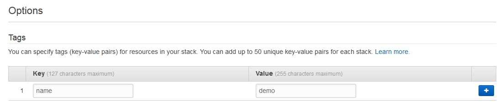

# Automates deployment and configuration of Graphexp & Gremlin console on Amazon EC2 for use with Amazon Neptune 

This AWS Cloudformation template will launch an Amazon EC2 instance and Security Group with updated configuration to be used with Amazon Neptune. For more information on AWS Cloudformation visit: https://aws.amazon.com/cloudformation/

This cloudformation template can be launched in your account directly by clicking the below Launch Stack link:

| AWS Region | Short name | | 
| -- | -- | -- |
| US East (N. Virginia) | us-east-1 |  |

## Prerequisite

The cloudformation template will assume there is an already established Amazon Neptune Cluster. See the following links for how to create an Amazon Neptune Cluster for Gremlin:  

https://docs.aws.amazon.com/neptune/latest/userguide/get-started-CreateInstance-Console.html

https://docs.aws.amazon.com/neptune/latest/userguide/bulk-load.html

https://docs.aws.amazon.com/neptune/latest/userguide/bulk-load-tutorial-format-gremlin.html

## Step 1

Choose Stack name, Instance Type, KeyName, SSH Location and enter your Amazon Neptune endpoint and Amazon Neptune Security Group Id

Do not append the port information to the Neptune endpoint and for your Graphexp Access - use your IP, otherwise access will be public.

## Step 2

Add additional tags for your stack

## Step 3 (Graphexp)

Upon stack completion, enter the public IP of your EC2 instance to view graphexp.

For more information on Graphexp visit: https://github.com/bricaud/graphexp

## Step 4 (Gremlin Console)

To launch the Gremlin Console do the following: 

1. SSH into the EC2 instance
2. sh scripts/connect.sh
3. :remote connect tinkerpop.server conf/neptune-remote.yaml
4. :remote console
5. gremlin> g.V().limit(2) (to test connectivity)

For more information on Graphexp visit: http://tinkerpop.apache.org/docs/current/tutorials/the-gremlin-console/

## License

Copyright 2011-2018 Amazon.com, Inc. or its affiliates. All Rights Reserved.

Licensed under the Apache License, Version 2.0 (the "License"). You may not use this file except in compliance with the License. A copy of the License is located at

[http://aws.amazon.com/apache2.0/](http://aws.amazon.com/apache2.0/)

or in the "license" file accompanying this file. This file is distributed on an "AS IS" BASIS, WITHOUT WARRANTIES OR CONDITIONS OF ANY KIND, either express or implied. See the License for the specific language governing permissions and limitations under the License.

