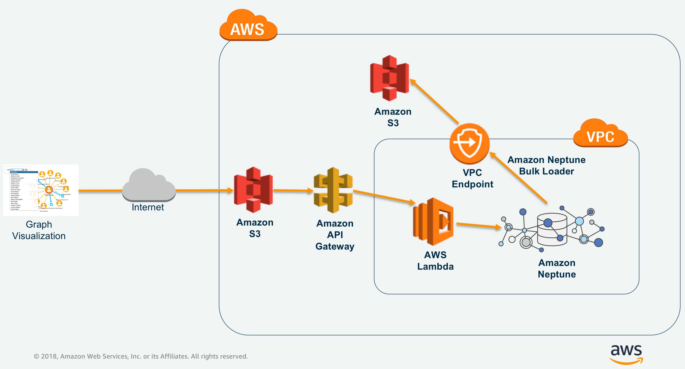

# Visualize data in Amazon Neptune using Ogma library

This GitHub lab will take you through hands-on exercise of visualizing graph data in Amazon Neptune using Ogma library.
Amazon Neptune is a fast, reliable, fully managed graph database service available from AWS.
With Amazon Neptune you can use open source and popular graph query languages such as Apache TinkerPop Gremlin for property graph databases or SPARQL for W3C RDF model graph databases.

In the rest of the lab, we will focus on visualizing data in Amazon Neptune using [Ogma](http://ogma.linkurio.us).
Ogma is a Javascript library for large-scale interactive graph visualizations. Ogma offers set of features required to display, explore, and interact with graph data in a web application. This includes connecting to various sources to import and export data, smart layouts algorithms, rich user interactions, and fully customizable visual styles.

## PREREQUISITES:

1. Amazon Neptune Cluster
2. Access to [AWS IAM Permissions](https://docs.aws.amazon.com/cli/latest/userguide/getting-started-prereqs.html#getting-started-prereqs-iam) for
   -> creating AWS Lambda functions
   -> creating IAM roles for Amazon Neptune cluster to access S3 and, for API Gateway to access AWS Lambda functions
   -> APIs in Amazon API Gateway
   -> Amazon S3 buckets
   -> creating and attaching VPC Endpoints to the VPC
3. Ogma library

## Architecture

Below is the architecture that we will be using to visualize data in Amazon Neptune using [Ogma](https://ogma.linkurio.us).
Since Amazon Neptune instance can't be accessed outside the VPC, we are using AWS Lambda function in VPC. This AWS Lambda function is accessed through the proxy created and exposed to internet using Amazon API Gateway.
Once the proxy is exposed, we can access the APIs from Javascript code being executed from Amazon S3 (static website).



## Steps

1. [Provision Amazon Neptune Cluster](#1-provision-amazon-neptune-cluster)
2. [Load sample data into Amazon Neptune](#2-load-sample-data-into-amazon-neptune)
3. [Create and Configure AWS Lambda Function](#3-create-and-configure-aws-lambda-function)
4. [Create and Configure Amazon API Gateway - Proxy API](#4-create-and-configure-amazon-api-gateway---proxy-api)
5. [Configure the hosting for the static website](#5-configure-the-hosting-for-the-static-website)

### 1. Provision Amazon Neptune Cluster

Follow the procedure mentioned in [Amazon Neptune Documentation](https://docs.aws.amazon.com/neptune/latest/userguide/neptune-setup.html) to provision a new Amazon Neptune Instance inside a VPC.<BR/>

### 2. Load sample data into Amazon Neptune

This GitHub repo provides you [sample twitter data](sampledata/) that you can load into Amazon Neptune.
To load the data into Amazon Neptune, you will need to <br>

- copy the sample data to Amazon S3
- create IAM Role for accessing S3 bucket and attach it to Amazon Neptune cluster
- create Amazon S3 VPC Endpoint and attach it to the VPC
- create a "bastion host" inside the same VPC to load data from Amazon S3 into Amazon Neptune.<br/>

For details on how to load data from Amazon S3 to Amazon Neptune please refer [this](https://docs.aws.amazon.com/neptune/latest/userguide/bulk-load.html) link from AWS documentation.

### 3. Create and configure AWS Lambda function

Once you load data into Amazon Neptune, you need to create the AWS Lambda function to access this data and expose it over RESTful interface through Amazon API Gateway.<br/>
Execute below steps from the terminal to create the deployment package and create AWS Lambda function -

```
sudo yum install git

sudo yum install npm

git clone https://github.com/aws-samples/amazon-neptune-samples.git

cd gremlin/visjs-neptune

npm install

zip lambdapackage.zip -r node_modules/ indexLambda.js

```

https://docs.aws.amazon.com/cli/latest/userguide/getting-started-prereqs.html#getting-started-prereqs-iam
Once AWS Lambda deployment package (.zip file) is ready, we can create the Lambda function using [AWS CLI](https://aws.amazon.com/cli/).<br/>
To install and configure AWS CLI on your operating system, please refer to - https://docs.aws.amazon.com/cli/latest/userguide/installing.html <br/>
After installing AWS CLI, run `aws configure` to set the access_key, secret_key and AWS region.

Run below commands to create AWS Lambda function within the same VPC as Amazon Neptune cluster.

AWS Lambda function would need an execution role to be able to create ENIs in the VPC for accessing the Neptune instance.

```
aws iam create-role --path /service-role/ --role-name lambda-vpc-access-role --assume-role-policy-document '{
  "Version": "2012-10-17",
  "Statement": [
    {
      "Effect": "Allow",
      "Principal": {
        "Service": "lambda.amazonaws.com"
      },
      "Action": "sts:AssumeRole"
    }
  ]
}' --description "VPC Access role for lambda function"
```

Below is the command to attach the policy provided by AWS to the above role.

```
aws iam attach-role-policy --role-name lambda-vpc-access-role --policy-arn arn:aws:iam::aws:policy/service-role/AWSLambdaENIManagementAccess
```

We will now create the AWS Lambda function using the deployment package and IAM role created in previous steps.<BR>

NOTE: Use `subnet-ids` from the VPC in which Amazon Neptune cluster is provisioned.

```
aws lambda create-function --function-name <lambda-function-name> \
--role "arn:aws:iam::<aws-account-number>:role/service-role/lambda-vpc-access-role" \
--runtime nodejs14.x --handler indexLambda.handler \
--description "Lambda function to make gremlin calls to Amazon Neptune" \
--timeout 120 --memory-size 256 --publish \
--vpc-config SubnetIds=<subnet-ids>,SecurityGroupIds=<sec-group-id> \
--zip-file fileb://lambdapackage.zip \
--environment Variables="{NEPTUNE_CLUSTER_ENDPOINT=<your-neptune-cluster-endpoint>,NEPTUNE_PORT=<your-neptune-db-port>}"
```

We recommend you to go through the AWS Lambda function source code at this point to understand how to query data using `Gremlin` APIs and how to parse and reformat the data to send it over to the clients.

### 4. Create and Configure Amazon API Gateway - Proxy API

We would expose the AWS Lambda function created in the earlier step through Amazon API Gateway Proxy API.
For more details on this approach please refer to AWS documentation @https://docs.aws.amazon.com/apigateway/latest/developerguide/set-up-lambda-proxy-integrations.html <br/>

First we create the Restful API using the below command from AWS CLI.

```
aws apigateway create-rest-api --name lambda-neptune-proxy-api --description "API Proxy for AWS Lambda function in VPC accessing Amazon Neptune" 
```

Note the value of "id" field from the earlier output and use it as a `<rest-api-id>` value below.

```
aws apigateway get-resources --rest-api-id <rest-api-id>
```

Note the value of "id" field from the earlier output and use it as a `<parent-id>` value below.
Below command would create a resource under the root strutrure of the API.

```
aws apigateway create-resource --rest-api-id <rest-api-id>  --parent-id <parent-id> --path-part {proxy+}
```

Note the value of "id" field from the output and use it as a `<resource-id>` in the command below.

```
aws apigateway put-method --rest-api-id <rest-api-id>  --resource-id <resource-id> --http-method ANY \
--authorization-type NONE
```

So far we created, an API, API Resource and Methods for that Resource (GET/PUT/POST/DELETE or ANY for all methods).
We will now create the API method integration, that would identify the AWS Lambda function for which this resource will be acting as a PROXY.

Use appropriate values obtained from the previous commands.

```
aws apigateway put-integration --rest-api-id <rest-api-id> \
--resource-id  <resource-id> --http-method ANY --type AWS_PROXY \
--integration-http-method POST  \
--uri arn:aws:apigateway:<aws-region-code>:lambda:path/2015-03-31/functions/arn:aws:lambda:<aws-region-code>:<aws-account-number>:function:<lambda-function-name>/invocations
```

Finally we deploy the API using below command.

```
aws apigateway create-deployment --rest-api-id <rest-api-id> --stage-name test
```

In order for Amazon API Gateway API, to invoke AWS Lambda function we either need to provide the "execution-role" to API Integration or we can also add the permission (subscription) in AWS Lambda explicitly that says an API "X" can invoke a lambda function. This API Gateway subscription is also reflected in AWS Console.

Execute below command to add API Gateway subscription/permission to AWS Lambda function.

```
aws lambda add-permission --function-name <lambda-function-name> \
--statement-id <any-unique-id> --action lambda:* \
--principal apigateway.amazonaws.com \
--source-arn arn:aws:execute-api:<aws-region-code>:<aws-account-number>:<rest-api-id>/*/*/*
```

We have now created an API Gateway proxy for the AWS Lambda function.

### 5. Configure the hosting for the static website

#### Option 1: AWS CloudFront

You can find more detailed instructions on how to set up Amazon CloudFront at https://github.com/aws-samples/amazon-cloudfront-secure-static-site#user-content-amazon-cloudfront-secure-static-website.

First, create a CloudFront Origin Access Id using the following command:

```bash
aws cloudfront create-cloud-front-origin-access-identity --cloud-front-origin-access-identity-config CallerReference="linkurious example",Comment="linkurious example"
```

Make a note of the value of the "`Id`" field.

Next, create a CloudFront distribution to the newly created S3 bucket, using the following command.
**NOTE:** Make sure to replace the `<bucket-name>` and `<origin-id>` placeholders with your own values.

```bash
aws cloudfront create-distribution --distribution-config file://cloudfront-create-distribution-config.txt
```

You can find an example of config file in `cloudfront-create-distribution-config.txt`. Make a note of the value of the `DomainName` field.

#### Option 2: Amazon S3 bucket

Now that we have all the backend infrastructure ready for handling the API requests to get data out from Amazon Neptune, let's create an Amazon S3 bucket that will be used to host a static website.<br/>

https://github.com/aws-samples/amazon-cloudfront-secure-static-site#user-content-amazon-cloudfront-secure-static-website

Run below commands to create an Amazon S3 bucket as a static website and upload the `visualize-graph.html` into it.

```
--create Amazon S3 bucket with public read access
aws s3api create-bucket --bucket <bucket-name> --acl public-read --region <aws-region-code> --create-bucket-configuration LocationConstraint=<aws-region-code>

--configure website hosting on S3 bucket
aws s3api put-bucket-website --bucket <bucket-name> --website-configuration '{
    "IndexDocument": {
        "Suffix": "index.html"
    },
    "ErrorDocument": {
        "Key": "error.html"
    }
}'
```

### 6. Build the static website

In order to build the example website, you will need [`Node.js`](https://nodejs.org/en/) and `npm` (comes together with t Node.js).

Then you will need to get your copy of Ogma library. You can copy the private `npm` link at `https://get.linkurio.us`. If you don't have access to it, you can get the evaluation version by contacting Linkurious team at `sales@linkurious.com`.

The private npm link will look like that: `https://get.linkurio.us/api/get/npm/ogma/<VERSION>/?secret=<YOUR_API_KEY>`, you can add it to your `package.json` file.

Then, you can install all the other dependencies and build the project:

```bash
npm install
npm run build
```

### 7. Upload HTML file to Amazon S3

The visualize-graph.html file that we have as a part of this GitHub repository has to be updated to reflect the API Gateway Endpoint that we created in the steps above.

Execute below commands to replace value of `PROXY_API_URL` placeholder by real API Gateway Endpoint.
You can obtain the value of `PROXY_API_URL` from AWS Management Console by navigating to API Gateway -> APIs -> Select the API Name -> Stages. Copy the value of `Invoke URL` field as `PROXY_API_URL` value as replace it in the below commands.
You can also construct this URL using `https://<rest-api-id>.execute-api.<aws-region-code>.amazonaws.com/<stage-name>`.

NOTE: While executing the below commands make sure to use escape character "\\" in URLs.

For Linux:

```
sed -i -e 's/PROXY_API_URL/<API-Gateway-Endpoint>/g' index.html 

e.g.
sed -i -e 's/PROXY_API_URL/https:\/\/7brms4lx43.execute-api.us-east-2.amazonaws.com\/test/g' index.html
```

For MacOS:

```
find . -type f -name index.html | xargs sed -i '' 's/PROXY_API_URL/<API-Gateway-Endpoint>/g'

e.g.
find . -type f -name index.html | xargs sed -i '' 's/PROXY_API_URL/https:\/\/7brms4lx43.execute-api.us-east-2.amazonaws.com\/test/g'
```

For Windows:

- Open "index.html"
- Locate the line where the "PROXY_API_URL" variable is set.
- Update the value to `https://<API-Gateway-Endpoint>/test`

Once you have replace the value of placeholder `PROXY_API_URL` in visualize-graph.html file, upload the file to S3 using below command.

```
--upload the html document with public read access
aws s3 cp ./  s3://<bucket-name> --recursive --exclude "*" --include "*.html" --include "dist" --acl public-read
```

And, you are all set!

Visualize the graph data through this application from below URL.

`http://<domain-name>.s3-website.<aws-region-code>.amazonaws.com`

Here `<domain-name>` is the value copied from creating a CloudFront distribution.


## Summary

In this GitHub lab, you learned how to visualize data from Amazon Neptune using [Ogma](https://ogma.linkurio.us) library, Amazon API Gateway and AWS Lambda service.
Feel free to send us your feedback and suggestions. We would be happy to incorporate those in our lab.
