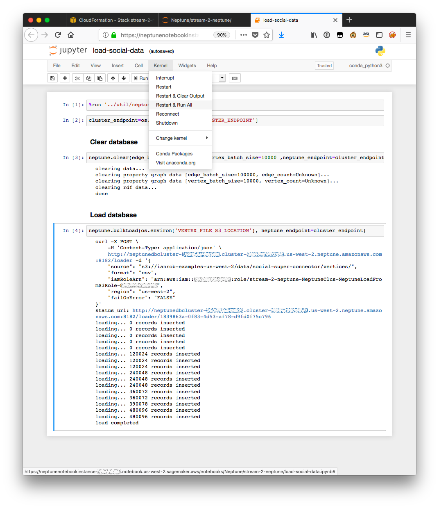
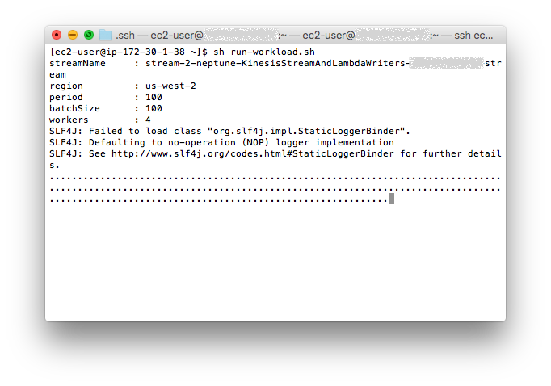
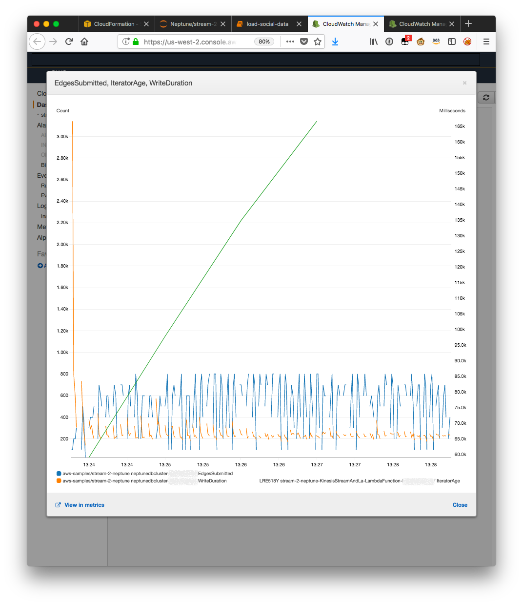
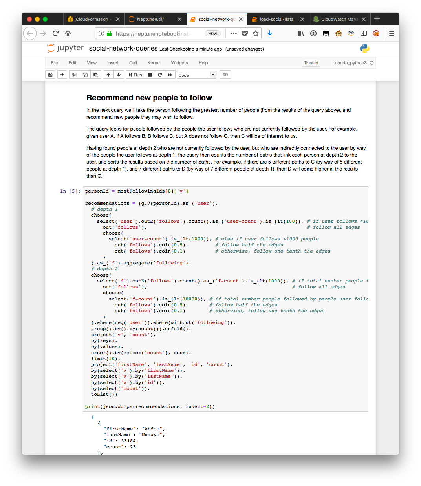
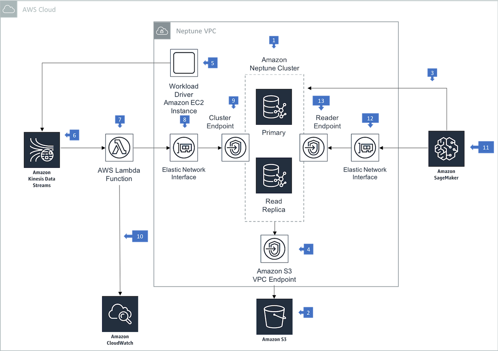

# Writing to Amazon Neptune from Amazon Kinesis Data Streams

This example demonstrates using an Amazon Kinesis Data Stream and AWS Lambda to issue batch writes to Amazon Neptune.

The architecture described here is [discussed in more detail](https://github.com/aws-samples/aws-dbs-refarch-graph/tree/master/src/writing-from-amazon-kinesis-data-streams) in the [Reference Architectures for Graph Databases on AWS](https://github.com/aws-samples/aws-dbs-refarch-graph).

## Scenario

The example simulates the growth of a social network. The database is initially populated with a user population. A workload driver then adds `follows` relationships between users. (This is somewhat artificial, but simplifies the application driver.)

The workload driver writes the details of each `follows` relationship to a Kinesis Data Stream. Lambda functions poll this stream and issue batch writes to Neptune. 

Using an Amazon SageMaker hosted Jupyter notebook, you can query the graoh while it is being populated.

An Amazon CloudWatch dashboard with a couple of custom metrics allows you to monitor the latency and thoughput of the system.

## Setup

Install the components using CloudFormation:

| Region | Stack |
| ---- | ---- |
|US East (N. Virginia) |  [](https://us-east-1.console.aws.amazon.com/cloudformation/home?region=us-east-1#/stacks/create/review?templateURL=https://s3.amazonaws.com/aws-neptune-customer-samples/neptune-sagemaker/cloudformation-templates/stream-2-neptune/stream-2-neptune-stack.json&stackName=stream-2-neptune&param_DbInstanceType=db.r4.xlarge&param_ShardCount=2&param_BatchReadSize=1000&param_BatchWriteSize=100&param_EC2ClientInstanceType=m5.large&param_DriverPeriod=100&param_DriverBatchSize=100&param_ConditionalCreate=true&param_VertexFileS3Location=s3://aws-neptune-customer-samples-us-east-1/neptune-sagemaker/data/social-super-connector/vertices/&param_EdgeFileS3Location=s3://aws-neptune-customer-samples-us-east-1/neptune-sagemaker/data/social-super-connector/edges/follows.csv.gz) |
|US East (Ohio) |  [](https://us-east-2.console.aws.amazon.com/cloudformation/home?region=us-east-2#/stacks/create/review?templateURL=https://s3.amazonaws.com/aws-neptune-customer-samples/neptune-sagemaker/cloudformation-templates/stream-2-neptune/stream-2-neptune-stack.json&stackName=stream-2-neptune&param_DbInstanceType=db.r4.xlarge&param_ShardCount=2&param_BatchReadSize=1000&param_BatchWriteSize=100&param_EC2ClientInstanceType=m5.large&param_DriverPeriod=100&param_DriverBatchSize=100&param_ConditionalCreate=true&param_VertexFileS3Location=s3://aws-neptune-customer-samples-us-east-2/neptune-sagemaker/data/social-super-connector/vertices/&param_EdgeFileS3Location=s3://aws-neptune-customer-samples-us-east-2/neptune-sagemaker/data/social-super-connector/edges/follows.csv.gz) |
|US West (Oregon) |  [](https://us-west-2.console.aws.amazon.com/cloudformation/home?region=us-west-2#/stacks/create/review?templateURL=https://s3.amazonaws.com/aws-neptune-customer-samples/neptune-sagemaker/cloudformation-templates/stream-2-neptune/stream-2-neptune-stack.json&stackName=stream-2-neptune&param_DbInstanceType=db.r4.xlarge&param_ShardCount=2&param_BatchReadSize=1000&param_BatchWriteSize=100&param_EC2ClientInstanceType=m5.large&param_DriverPeriod=100&param_DriverBatchSize=100&param_ConditionalCreate=true&param_VertexFileS3Location=s3://aws-neptune-customer-samples-us-west-2/neptune-sagemaker/data/social-super-connector/vertices/&param_EdgeFileS3Location=s3://aws-neptune-customer-samples-us-west-2/neptune-sagemaker/data/social-super-connector/edges/follows.csv.gz) |
|EU (Ireland) |  [](https://eu-west-1.console.aws.amazon.com/cloudformation/home?region=eu-west-1#/stacks/create/review?templateURL=https://s3.amazonaws.com/aws-neptune-customer-samples/neptune-sagemaker/cloudformation-templates/stream-2-neptune/stream-2-neptune-stack.json&stackName=stream-2-neptune&param_DbInstanceType=db.r4.xlarge&param_ShardCount=2&param_BatchReadSize=1000&param_BatchWriteSize=100&param_EC2ClientInstanceType=m5.large&param_DriverPeriod=100&param_DriverBatchSize=100&param_ConditionalCreate=true&param_VertexFileS3Location=s3://aws-neptune-customer-samples-eu-west-1/neptune-sagemaker/data/social-super-connector/vertices/&param_EdgeFileS3Location=s3://aws-neptune-customer-samples-eu-west-1/neptune-sagemaker/data/social-super-connector/edges/follows.csv.gz) |
|EU (London) |  [](https://eu-west-2.console.aws.amazon.com/cloudformation/home?region=eu-west-2#/stacks/create/review?templateURL=https://s3.amazonaws.com/aws-neptune-customer-samples/neptune-sagemaker/cloudformation-templates/stream-2-neptune/stream-2-neptune-stack.json&stackName=stream-2-neptune&param_DbInstanceType=db.r4.xlarge&param_ShardCount=2&param_BatchReadSize=1000&param_BatchWriteSize=100&param_EC2ClientInstanceType=m5.large&param_DriverPeriod=100&param_DriverBatchSize=100&param_ConditionalCreate=true&param_VertexFileS3Location=s3://aws-neptune-customer-samples-eu-west-2/neptune-sagemaker/data/social-super-connector/vertices/&param_EdgeFileS3Location=s3://aws-neptune-customer-samples-eu-west-2/neptune-sagemaker/data/social-super-connector/edges/follows.csv.gz) |
|EU (Frankfurt) |  [](https://eu-central-1.console.aws.amazon.com/cloudformation/home?region=eu-central-1#/stacks/create/review?templateURL=https://s3.amazonaws.com/aws-neptune-customer-samples/neptune-sagemaker/cloudformation-templates/stream-2-neptune/stream-2-neptune-stack.json&stackName=stream-2-neptune&param_DbInstanceType=db.r4.xlarge&param_ShardCount=2&param_BatchReadSize=1000&param_BatchWriteSize=100&param_EC2ClientInstanceType=m5.large&param_DriverPeriod=100&param_DriverBatchSize=100&param_ConditionalCreate=true&param_VertexFileS3Location=s3://aws-neptune-customer-samples-eu-central-1/neptune-sagemaker/data/social-super-connector/vertices/&param_EdgeFileS3Location=s3://aws-neptune-customer-samples-eu-central-1/neptune-sagemaker/data/social-super-connector/edges/follows.csv.gz) |

You'll need to supply an *EC2KeyPairName* so that you can access the workload driver EC2 instance. Optionally, you can also specify a number of other parameters:

| Parameter | Description |
| --- | --- |
| DbInstanceType | Neptune database instance type (default *db.r4.xlarge*). |
| ShardCount | Number of shards in the Kinesis Data Stream (default *2*). Consider adjusting this to up to 2 x the number of vCPUs on the Neptune writer instance (e.g. for a db.r4.8xlarge instance, create 64 shards). The number of shards determines the number of concurrent Lambda functions writing batches to Neptune. |
| BatchReadSize | Number of records read from a Kinesis Data Stream shard by the Lambda function that writes to Neptune (default *1000*). |
| BatchWriteSize | Number of edges submitted to Neptune with each request by a Lambda function instance (default *100*). If *BatchReadSize* is 1000 and *BatchWriteSize* is 100, each Lambda function reads up to 1000 records from a Kinesis Data Stream shard, and then issues up to 10 requests to Neptune, each containing 100 edges.  |
| ConditionalCreate | Determines whether the Lambda function uses Gremlin’s conditional `coalesce()`-based idiom to upsert edges (default *false*). |
| EC2ClientInstanceType | EC2 workload driver instance type (default *m5.large*). |
| DriverPeriod | Delay in milliseconds between invocations of the workload driver (default *100*, meaning that the driver will be invoked 10 times per second). If *DriverBatchSize* is 100 and *DriverPeriod* is 100, the workload driver will add 1000 edge requests to the Kinesis Data Stream each second. |
| DriverBatchSize | Number of edges to submit to the Kinesis Data Stream with each invocation of the workload driver (default *100*). |
| VertexFileS3Location | S3 location of a file or directory containing vertex CSV files. |
| EdgeFileS3Location | S3 location of a *follows.csv.gz* CSV file. The file must be gzipped, and named *follows.csv.gz*. The workload driver assumes that the first line of this file contains headers. It further assumes that the third, fourth and fifth columns contain a *from vertex ID*, *to vertex ID* and *creation date*, respectively. |

Once the stack creation has completed, make a note of the *SageMakerNotebook*, *Dashboard* and *EC2WorkloadDriverInstance* outputs, and then complete the following steps:

### 1. Load the Vertex Data

  * Open the SageMaker notebook instance (use the *SageMakerNotebook* URI output from the stack) and navigate to the */Neptune/stream-2-neptune/load-social-data.ipynb* notebook.
  * Run the notebook. This will populate the Neptune cluster with vertex data.
  

### 2. Run the Workload

  * SSH into the EC2 instance that hosts the workload generator using the *EC2WorkloadDriverInstance* command from the stack output.
  * In a [Linux screen session](https://kb.iu.edu/d/acuy), run the *run-workload.sh* script.
  

  
### 3. Monitor Neptune
  
  * In your browser, open the CloudWatch metrics dashboard using the *Dashboard* URI from the stack output.
  

  
### 4. Query Neptune

  * In SageMaker, open the */Neptune/stream-2-neptune/social-network-queries.ipynb* notebook. You can run the queries here repeatedly, seeing how the results change as the social graph evolves.
  

## Walkthrough of the Architecture

#### Neptune

  1. The Amazon Neptune cluster comprises a primary instance and a single read replica.

#### Initial Load

  2. The cluster is loaded with vertex data from a CSV file in an Amazon S3 bucket.
  3. The loader REST API is invoked from an Amazon SageMaker hosted Jupyer notebook. 
  4. The loader requires a VPC endpoint for S3.

#### Workload

  5. A workload driver application on an Amazon EC2 instance sends requests to create new relationships in the social graph to an Amazon Kinesis Data Stream. This workload driver simulates many clients – perhaps Web or mobile clients – simultaneously making requests to create new relationships in the social graph. The workload driver will create approximately 2 million edge requests.
  6. The Kinesis Stream is sharded, and requests are partitioned across shards based on the ID of the person initiating the follows request (i.e. the *from* vertex ID).

#### Writing to Neptune

  7. AWS Lambda reads records from the data stream and invokes a Lambda function with an event that contains stream records. It processes one batch of records at a time from each shard (i.e. with two shards, there will be two concurrent Lambda invocations).
  8. The Lambda function is configured to access resources in the Neptune VPC.
  9. With each invocation, the Lambda function writes a batch of edges to the Neptune cluster endpoint.
  10. The Lambda function publishes custom throughput and latency metrics to Amazon CloudWatch.

#### Querying Neptune

  11. The SageMaker hosted Jupyter notebook allows you to query the social graph.
  12. SageMaker is configured to access resources in the Neptune VPC.
  13. Queries are issued against the Neptune reader endpoint.

## License Summary

This sample code is made available under a modified MIT license. See the LICENSE file.
