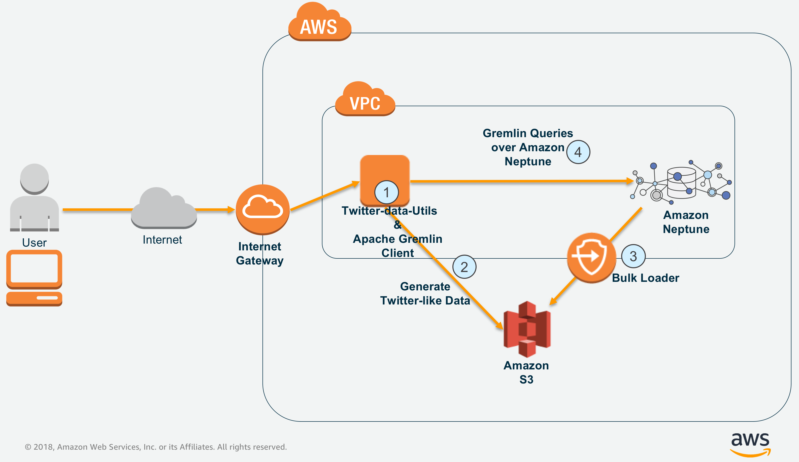

# Develop a graph database app using Amazon Neptune

This GitHub lab contains sample data and code for running a Twitter-like application in Amazon Neptune. The utility code illustrates how to use Amazon Neptune APIs, ingest data, and query graph. Developers can use or modify the code to build and operate their custom graph applications, or create similar java and groovy files to interact with Amazon Neptune.

When the reader has completed this Code Pattern, they will understand how to:
* Generate a synthetic twitter-like graph dataset
* Upload graph dataset to Amazon S3
* Use Amazon Neptune Bulk Loader to import graph data in csv files into Amazon Neptune graph database
* Query and update graph data using Apache Gremlin Console and REST API



## Flow

1. The user clones this GitHub repo (twitter-like-app)
2. The user generates Twitter sample data using Neptune java utility in this repo (graph data would be available in Amazon S3)
3. The user loads this data into Amazon Neptune using Amazon Neptune Bulk Loader utility
4. The user makes search queries and update the graph using Apache Tinkerpop Gremlin client

## Features
* This is fully extensible code wherein developers can change the number/type of vertices and edges by modifying the config JSON files
* Sample large, medium and tiny config files are provided to test large (upto millions of vertices and edges), medium and small datasets.

## Prerequisites

- Provision Amazon Neptune Cluster (single node)
- Create Amazon S3 bucket 
- Create IAM Role and attach it to the Amazon Neptune cluster for read-only access to Amazon S3
- Create Amazon S3 VPC Endpoint and attach it to the VPC in which Amazon Neptune cluster is provisioned https://docs.aws.amazon.com/neptune/latest/userguide/bulk-load-tutorial-IAM.html
- Provision an Amazon EC2 instance with Instance Profile that allows to read/write to Amazon S3. 
https://docs.aws.amazon.com/IAM/latest/UserGuide/id_roles_use_switch-role-ec2.html
- Install and configure Java and Maven on the above EC2 instance. Please follow the steps upto step#4 from the document @. https://docs.aws.amazon.com/neptune/latest/userguide/access-graph-gremlin-java.html. 
- Install Apache Tinkerpop Gremlin client and configure the connectivity to Amazon Neptune as described here - https://docs.aws.amazon.com/neptune/latest/userguide/access-graph-gremlin-console.html

# Steps
## Run locally
1. [Install prerequisites](#1-install-prerequisites)
2. [Clone the repo](#2-clone-the-repo)
3. [Generate the graph sample](#3-generate-the-graph-sample)
4. [Load graph data into Amazon Neptune](#4-load-graph-data-into-amazon-neptune)
5. [Run interactive remote queries](#5-run-interactive-remote-queries)

### 1. Install prerequisites
Please install and configure all the softwares as mentioned in the prerequisites section above.
Note that Amazon Neptune is only accessible within a VPC. <br/>NOTE: If you want to access Amazon Neptune instance from outside VPC consider implementing a reverse proxy solution in front of Amazon Netune.


### 2. Clone the repo

Clone the `twitter-like-app` repo on the EC2 instance and run `mvn package`.

```
sudo yum install git
git clone https://github.com/EjazSayyed/twitter-like-app.git
cd twitter-like-app/
mvn package
```

### 3. Generate the graph sample

Run the below command in `twitter-like-app` folder.
```
./run.sh gencsv csv-conf/twitter-like-w-date.json <s3-bucket> <bucket-folder>
```
Above command generates Twitter-like data into `/tmp` folder on a local filesystem and then uploads it to the Amazon S3 bucket you would specify as an argument automatically.

### 4. Load graph data into Amazon Neptune

Amazon Neptune provides a process for loading data from external files directly into a Neptune DB instance. You can use this process instead of executing a large number of INSERT statements, addVertex and addEdge steps, or other API calls.
This utility is called the Neptune Loader. For more information on Loader command please refer - https://docs.aws.amazon.com/neptune/latest/userguide/bulk-load.html <br/>
NOTE:<br/>1. You need to create and attach an IAM role to Amazon Neptune cluster which will allow the cluster to issue `Get` requests to Amazon S3. <br/>
2. You will also need to create an 'Amazon S3 VPC Endpoint' so that Amazon Neptune cluster can have access to S3 over private network.<br/>
Both of these steps are mentioned in https://docs.aws.amazon.com/neptune/latest/userguide/bulk-load-tutorial-IAM.html

Run below command in `twitter-like-app` folder to load data from S3 bucket into Amazon Neptune.
This utility uses Neptune Loader internally to bulk load data into Amazon Neptune. 
```
./run.sh import <neptune-cluster-endpoint>:<port> <iam-role-arn> <s3-bucket-name>/<folder-name> <aws-region-code>

e.g. 
./run.sh import mytwitterclst.cluster-crhihlsciw0e.us-east-2.neptune.amazonaws.com:8182 arn:aws:iam::213930781331:role/s3-from-neptune-2 neptune-s3-bucket/twitterlikeapp us-east-1
```

Alternatively, below is the sample `curl` command to load data into Amazon Neptune using Neptune Loader.
```
curl -X POST -H 'Content-Type: application/json' http://<amazon-neptune-cluster-endpoint>:8182/loader -d '
{
"source" : "s3://bucket-name/bucket-folder/",
"format" : "csv",
"iamRoleArn" : "arn:aws:iam::<account-number>:role/<role-name>",
"region" : "us-east-1",
"failOnError" : "FALSE"
}'
```


### 5. Run interactive remote queries

Now it is time to run few sample queries on the data set that we have just loaded into Amazon Neptune.

Once you install and configure the Apache Tinkerpop Gremlin Console and are able to connect to your Neptune cluster as mentioned @ https://docs.aws.amazon.com/neptune/latest/userguide/access-graph-gremlin-console.html, follow the below steps to run the sample queries.

```
[ec2-user@ip-172-31-59-189 bin]$ pwd
/home/ec2-user/apache-tinkerpop-gremlin-console-3.3.2/bin
[ec2-user@ip-172-31-59-189 bin]$ ./gremlin.sh 

         \,,,/
         (o o)
-----oOOo-(3)-oOOo-----
plugin activated: tinkerpop.server
plugin activated: tinkerpop.utilities
plugin activated: tinkerpop.tinkergraph
gremlin> :remote connect tinkerpop.server conf/neptune-remote.yaml
==>[neptune-cluster-endpoint]/172.31.23.188:8182
gremlin> :remote console
==>All scripts will now be sent to Gremlin Server - [neptune-cluster-endpoint]/172.31.23.188:8182] - type ':remote console' to return to local mode
gremlin> 
```
Now, let us find a sample user from `User` vertices and use it for running few queries.

```
gremlin> g.V().has('User','~id','1').valueMap()
==>{name=[Brenden Johnson]}
```
We shall use the above name to run few queries here -

#1 Who follows ‘Brenden Johnson’?
```
gremlin> g.V().has('name', 'Brenden Johnson').in('Follows').values('name')
==>Jameson Kreiger
==>Yasmeen Casper
==>Maverick Altenwerth
==>Isabel Gibson
...
```

#2 Find Brenden Johnson' followers who retweeted his tweets
```
gremlin> g.V().has('name', 'Brenden Johnson').in('Follows').as('a').out('Retweets').in('Tweets').has('name', 'Brenden Johnson').select('a').values('name').dedup()
==>Quentin Watsica
==>Miss Vivianne Gleichner
==>Mr. Janet Ratke
...
```

You can find sample search and insert queries in [samples/twitter-like-queries.txt](samples/twitter-like-queries.txt).

# Extension
In the above example we have demonstrated how to generate and load simple data set into Amazon Neptune. <br/>
By modifying the `twitter-like-w-date.json` file (under `csv-conf/` folder) further, you can create other properties of vertices/edges.<br/>
You can also change the number of vertices and number of edges from a specific type of vertex.<br/>
There are other tiny, small, medium and large sample JSON configuration files already created to generate a random data set.<br/>
You can use these configuration files to generate a huge dataset, run interactive queries on the data and test the performance of a Amazon Neptune cluster.<br/>

# Connecting to an Amazon Neptune cluster from the RESTful WS Client
You can send requests to an Amazon Neptune instance running in a VPC from a RESTful WS client such as Postman using any of the below approaches:
* RESTful WS client -> Amazon ALB -> HA Proxy -> Amazon Neptune
* RESTful WS client -> Amazon NLB -> Amazon Neptune
* Any other similar approaches which exposes Amazon Neptune endpoint through proxy layer


# Links
* [Amazon Neptune Samples](https://github.com/aws-samples/amazon-neptune-samples): Sample data sets and code examples for Amazon Neptune.
* [Amazon Neptune Tools](https://github.com/awslabs/amazon-neptune-tools): Tools and utilities related to Amazon Neptune.

# Learn more

* [Deep dive on Amazon Neptune](https://www.youtube.com/watch?v=6o1Ezf6NZ_E)
* [Amazon Neptune FAQs](https://aws.amazon.com/neptune/faqs/)

# Credits
This GitHub lab is taken from IBM's JanusGraph+Cassandra lab @ https://github.com/IBM/janusgraph-utils.
Many of our customers reached out to us with requests on producing the sample graph data to run ad-hoc queries, do the experimentation and test query performance on Amazon Neptune.<br/>
Feel free to send your suggestions and pull requests to this GitHub lab.

# License
[Apache 2.0](LICENSE)
