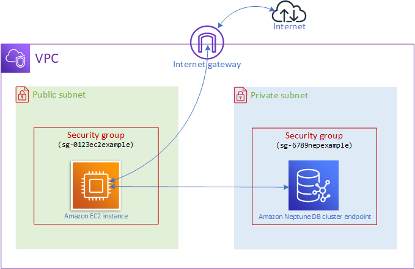

# Neptune Connection Troubleshooting Guide

This guide helps troubleshoot connectivity issues when accessing Amazon Neptune
through a bastion host using AWS Systems Manager Session Manager.

The assumed setup here is that you used the CDK template within this project to create a
Neptune DB (NDB) instance, and a "bastion" host. A bastion is an EC2 instance within the
same VPC as the Neptune DB, configured in way that it can be accessed from outside
the VPC, but the bastion itself can access the Neptune DB, providing a pathway to the cluster
from outside the VPC, through port forwarding. The setup is similar to the one shown below:




At a high level there can be two sources of error preventing you from successfully posting
requests to a Neptune cluster:

1. **Reachability of the cluster**: Can we access the cluster to make requests to it?
   VPC and security groups are usually the factors here. If your request comes from
   within the same VPC as the cluster you should generally be able to reach the cluster,
   **if your security groups are set up correctly**.
   Timeout errors usually indicate reachability issues.
2. **Authentication**: if we can reach the cluster and make requests to it, are we authorized
   to perform certain actions on it? IAM roles, policies, and request signing are usually
   the factors here. Here the role+policy attached to the entity making the request should
   allow the entity to perform the action on the resource, e.g. `neptune-db:GetEngineStatus`,
   and (when using IAM auth) the request should be signed to prove its origin.
   Authentication/SSL/TLS errors point to this kind of issue.

We have created the `test_neptune_connection.py` script to help you test and resolve connectivity issues.
You can first execute this on your bastion host, and if successful, set up port forwarding through
AWS Systems Manager (SSM) as shown below, and try it again from outside the VPC.

## Prerequisites

To run the `test_neptune_connection.py` script you need:

1. Required packages:
```bash
# If on CDD/AL2 use "urllib3<2"
pip install requests urllib3 boto3 botocore
```

2. AWS credentials configured with appropriate permissions:
- SSM access to the bastion host (if using one)
- IAM authentication permissions

## Testing Connectivity

### 1. Direct Connection from Bastion Host (or any host within the VPC)

First, verify you can connect directly from the bastion host:

```bash
# Start regular SSM session
aws ssm start-session --target <instance-id>

# Switch from the ssm user to the ec2-user (optional)
sudo su ec2-user

# Test connection using Python script
# Before running, ensure `endpoint` var in the script is set
# to original endpoint e.g. neptunedbcluster-XXX.cluster-XXX.us-east-1.neptune.amazonaws.com
python test_neptune_connection.py # You can use emacs/nano and copy paste the contents to run this on the bastion
```

If this works but local connection doesn't, proceed to **port forwarding setup**.

If connection from within the VPC doesn't work, ensure your security groups
for the Neptune instance and bastion host are configured correctly.

In general:

* Outgoing rules on the security groups attached to the bastion should allow all outgoing traffic. This is usually the default.
* More importantly, **the security group attached to the cluster needs to allow incoming TCP traffic on port 8182, from the security
  group attached to the bastion**. Similarly if you created a Graph Notebook Instance and it has another security group attached,
  the Neptune security group needs to allow traffic coming from that SG.

> The CDK project sets this up correctly for you, creating the appropriate inbound/output rules on the SGs attached to the bastion
  and Neptune DB instance. You can re-use this SG when creating a Graph Notebook on SageMaker.


See [Create a security group using the VPC console](https://docs.aws.amazon.com/neptune/latest/userguide/get-started-vpc.html#security-vpc-security-group) and
[Connecting an Amazon EC2 instance to Amazon Neptune cluster in the same VPC](https://docs.aws.amazon.com/neptune/latest/userguide/get-started-connect-ec2-same-vpc.html)
for more details.

### 2. Port Forwarding Setup

If we are able to connect to NDB from the bastion (same VPC), then our next step is to make it possible to connect
to NDB from outside the VPC, using the bastion as an intermediate for our requests.

To do so we need to set up
port forwarding to a remote host, which in our case is the Neptune DB cluster, to which we are connecting through
the bastion. This will allow us to post requests to `localhost` which will get forwarded, through the bastion
to the NDB endpoint.

To ease the process our CDK sets up the bastion to allow connecting to it through the AWS Systems Manager,
which makes authentication setup easier (instead of using key pairs or other auth methods).

To set up port forwarding from your local machine through the bastion, run the following in a separate terminal to establish
a port forwarding connection:

```bash
aws ssm start-session \
  --target <bastion-instance-id> \
  --document-name AWS-StartPortForwardingSessionToRemoteHost \
  --parameters '{
    "portNumber":["8182"],
    "localPortNumber":["8182"],
    "host":["your-neptune-endpoint"]
  }'
```

See the [SSM docs](https://docs.aws.amazon.com/systems-manager/latest/userguide/session-manager-working-with-sessions-start.html#sessions-remote-port-forwarding) for more details on the parameters here.

Your local user/role will need to have the requisite permissions to perform SSM actions. See the
[policy examples](https://docs.aws.amazon.com/systems-manager/latest/userguide/security_iam_id-based-policy-examples.html#customer-managed-policies)
on the SSM docs for that.

>**Keep this session running while testing the connection.** Remember that SSM sessions time out after a while, so you might need to re-start the SSM session after a while.

### 3. Local Connection Testing

In a new terminal, test the connection:

```bash
# Test connection using Python script, ensure endpoint var is set to "localhost"
python test_neptune_connection.py
```

## Common Issues and Solutions

### 1. Connection Timeout
```
Connection error: HTTPSConnectionPool(host='localhost', port=8182): Max retries exceeded
```

**Solutions:**
- Verify port forwarding session is active
- Check security group allows traffic from bastion/notebook instance to Neptune (port 8182)
- Ensure bastion instance has outbound internet access

### 2. Authentication Errors
```
Missing Authentication Token or Access Denied
```

**Solutions:**
- Verify IAM role has proper Neptune permissions:
  ```json
  {
    "Version": "2012-10-17",
    "Statement": [
      {
        "Effect": "Allow",
        "Action": [
          "neptune-db:GetEngineStatus",
          "neptune-db:ReadDataViaQuery",
          "neptune-db:WriteDataViaQuery",
          "neptune-db:DeleteDataViaQuery",
          "neptune-db:GetQueryStatus",
          "neptune-db:CancelQuery"
        ],
        "Resource": ["arn:aws:neptune-db:region:account:*/database"]
      }
    ]
  }
  ```
- Check AWS credentials are properly configured
- Ensure requests include proper SigV4 signing

### 3. SSL/TLS Issues
```
SSLError or EOF occurred in violation of protocol
```

**Solutions:**
- Use HTTPS with SSL verification disabled for testing
- Ensure proper Host header is set in requests
- Use AWS-StartPortForwardingSessionToRemoteHost instead of AWS-StartPortForwardingSession

## Verifying Success

A successful connection should return Neptune status information:

```json
{
  "status": "healthy",
  "startTime": "...",
  "dbEngineVersion": "...",
  "role": "writer",
  ...
}
```

## Additional Resources

- [Neptune Security Documentation](https://docs.aws.amazon.com/neptune/latest/userguide/security.html)
- [SSM Port Forwarding Documentation](https://docs.aws.amazon.com/systems-manager/latest/userguide/session-manager-working-with-sessions-start.html#sessions-remote-port-forwarding)
- [Neptune IAM Authentication](https://docs.aws.amazon.com/neptune/latest/userguide/iam-auth.html)
- [How to make signed requests to Neptune using Python](https://docs.aws.amazon.com/neptune/latest/userguide/iam-auth-connecting-python.html)
